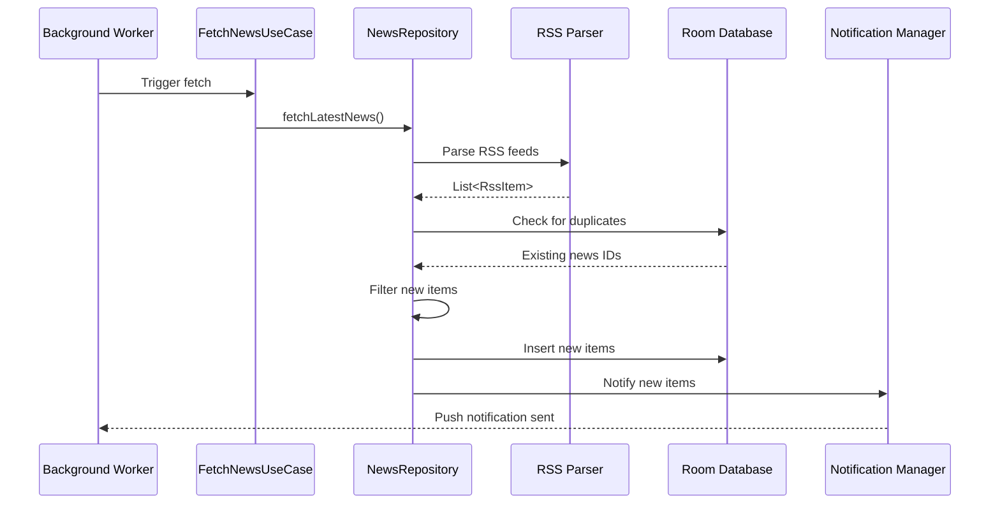
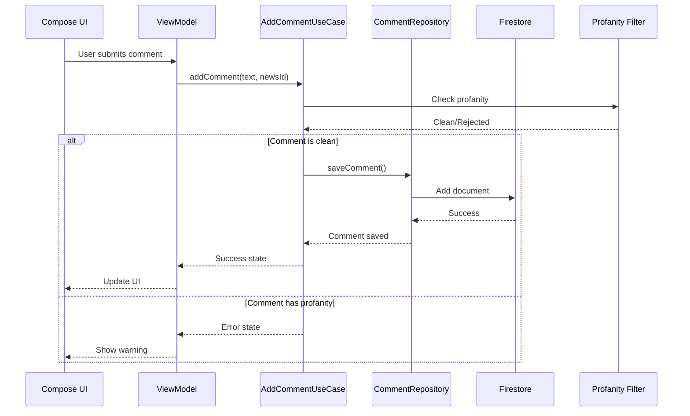
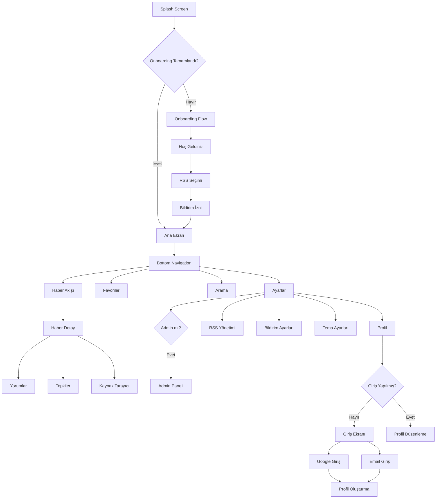
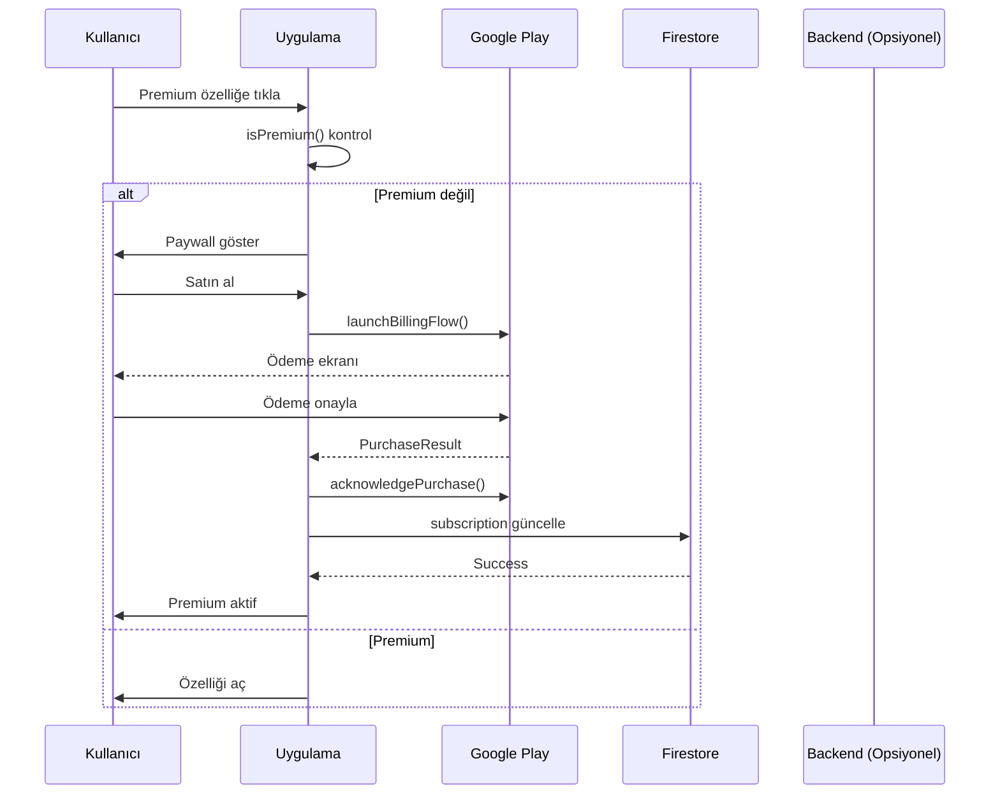

# Design Document: Telegram-Style News App

## Overview

Telegram-Style News App, Android platformunda Telegram kanalları benzeri bir kullanıcı deneyimi sunan modern bir haber uygulamasıdır. Uygulama, RSS/XML beslemelerinden haber içeriği çekerek kullanıcılara anlık haber akışı sağlar ve sosyal etkileşim özellikleri (yorum, tepki) ile zenginleştirilmiş bir deneyim sunar.

### Temel Özellikler

- RSS besleme yönetimi ve otomatik içerik çekme
- Arka plan güncelleme mekanizması (15 dakika aralıklarla)
- Push bildirim sistemi
- HyperIsle (Dynamic Island benzeri) animasyonlu başlık gösterimi
- Telegram tarzı haber akışı UI
- Material Design 3 + Dark mode (Xiaomi HyperOS estetiği)
- Kullanıcı hesapları (Google, Email/Şifre)
- Yorum ve tepki sistemi
- Admin paneli ve moderasyon
- Son dakika haber tanımı ve özel gösterim
- Çevrimdışı okuma, favoriler, arama, filtreleme

### Teknik Stack

- **Platform**: Android (Min SDK 26, Target SDK 34)
- **Dil**: Kotlin 1.9+
- **UI Framework**: Jetpack Compose 1.5+
- **Yerel Veritabanı**: Room Database
- **Arka Plan İşleme**: WorkManager
- **Ağ İşlemleri**: Retrofit + OkHttp
- **RSS Parsing**: Rome RSS Parser
- **Backend**: Firebase (Authentication, Firestore, Cloud Messaging)
- **Görsel Yükleme**: Coil
- **Dependency Injection**: Hilt

## Architecture

Uygulama, Clean Architecture prensipleri ve MVVM (Model-View-ViewModel) pattern'i kullanarak katmanlı bir mimari yapısına sahiptir.

### Mimari Katmanlar

```
┌─────────────────────────────────────────────────────────┐
│                    Presentation Layer                    │
│  (Jetpack Compose UI + ViewModels + UI State)           │
└─────────────────────────────────────────────────────────┘
                           ↓
┌─────────────────────────────────────────────────────────┐
│                     Domain Layer                         │
│     (Use Cases + Domain Models + Repository Interfaces) │
└─────────────────────────────────────────────────────────┘
                           ↓
┌─────────────────────────────────────────────────────────┐
│                      Data Layer                          │
│  (Repository Implementations + Data Sources + Mappers)  │
└─────────────────────────────────────────────────────────┘
                           ↓
┌──────────────────────┬──────────────────────────────────┐
│   Local Data Source  │    Remote Data Source            │
│   (Room Database)    │    (RSS Feeds + Firebase)        │
└──────────────────────┴──────────────────────────────────┘
```

### Modül Yapısı

```
app/
├── presentation/
│   ├── ui/
│   │   ├── feed/          # Haber akışı ekranı
│   │   ├── detail/        # Haber detay ekranı
│   │   ├── favorites/     # Favoriler ekranı
│   │   ├── search/        # Arama ekranı
│   │   ├── settings/      # Ayarlar ekranı
│   │   ├── auth/          # Giriş/Kayıt ekranları
│   │   ├── profile/       # Profil ekranı
│   │   ├── admin/         # Admin paneli
│   │   └── components/    # Paylaşılan UI bileşenleri
│   └── viewmodel/
├── domain/
│   ├── model/             # Domain modelleri
│   ├── repository/        # Repository interface'leri
│   └── usecase/           # Use case'ler
├── data/
│   ├── repository/        # Repository implementasyonları
│   ├── local/
│   │   ├── dao/           # Room DAO'ları
│   │   ├── entity/        # Room Entity'leri
│   │   └── database/      # Database sınıfı
│   ├── remote/
│   │   ├── rss/           # RSS API servisleri
│   │   └── firebase/      # Firebase servisleri
│   └── mapper/            # Data <-> Domain mappers
├── worker/                # Background workers
└── di/                    # Dependency injection modülleri
```

### Veri Akışı

#### RSS Haber Çekme Akışı



#### Yorum/Tepki Akışı



## Components and Interfaces

### 1. RSS Feed Manager

**Sorumluluk**: RSS beslemelerini yönetme, içerik çekme ve ayrıştırma

**Interface**:
```kotlin
interface RssFeedManager {
    suspend fun addFeed(url: String): Result<RssFeed>
    suspend fun removeFeed(feedId: String): Result<Unit>
    suspend fun fetchAllFeeds(): Result<List<NewsItem>>
    suspend fun fetchFeed(feedId: String): Result<List<NewsItem>>
    suspend fun validateFeedUrl(url: String): Boolean
}
```

**Implementasyon Detayları**:
- Rome RSS Parser kullanarak RSS/XML ayrıştırma
- Timeout: 10 saniye
- Retry mekanizması: 3 deneme
- Hata durumunda diğer beslemelere devam etme
- Özet çıkarma stratejisi: `<description>` → `<content:encoded>` → otomatik özet

### 2. Summary Generator

**Sorumluluk**: RSS'te özet yoksa otomatik özet oluşturma

**Interface**:
```kotlin
interface SummaryGenerator {
    suspend fun generateSummary(
        content: String,
        isBackgroundTask: Boolean,
        wordLimit: Int = 20
    ): String
}
```

**Implementasyon Detayları**:
- **Arka plan işleme**: TextRank algoritması (yüksek kalite, ~100ms/haber)
- **Anlık işleme**: Extractive yöntem (hızlı, ~5ms/haber)
- HTML etiketlerini temizleme
- Maksimum 300 karakter sınırı
- Batch işleme: Maksimum 10 haber/batch

### 3. Background Sync Worker

**Sorumluluk**: Periyodik RSS kontrolü ve yeni içerik algılama

**Interface**:
```kotlin
class NewsSyncWorker(
    context: Context,
    params: WorkerParameters
) : CoroutineWorker(context, params) {
    override suspend fun doWork(): Result
}
```

**Implementasyon Detayları**:
- WorkManager PeriodicWorkRequest (15 dakika)
- Ağ bağlantısı kontrolü (NetworkType.CONNECTED)
- Pil tasarrufu modunda çalışma
- Yeni haber algılandığında push bildirim tetikleme
- Hata durumunda retry policy (exponential backoff)

### 4. Notification Manager

**Sorumluluk**: Push bildirim gönderme ve yönetme

**Interface**:
```kotlin
interface NotificationManager {
    fun sendNewsNotification(newsItem: NewsItem)
    fun sendBreakingNewsNotification(newsItem: NewsItem)
    fun cancelNotification(notificationId: Int)
    fun createNotificationChannels()
}
```

**Implementasyon Detayları**:
- Android Notification Channels kullanımı
- Kanal 1: "Genel Haberler" (varsayılan öncelik)
- Kanal 2: "Son Dakika" (yüksek öncelik)
- Bildirime tıklandığında ilgili haber detayına yönlendirme
- Kaynak bazında bildirim tercihleri

### 5. HyperIsle Manager

**Sorumluluk**: Dynamic Island benzeri animasyonlu başlık gösterimi

**Interface**:
```kotlin
interface HyperIsleManager {
    fun showBreakingNews(newsItem: NewsItem)
    fun hideHyperIsle()
    fun isHyperIsleEnabled(): Boolean
    fun setHyperIsleEnabled(enabled: Boolean)
}
```

**Implementasyon Detayları**:
- Overlay window kullanarak ekranın üst kısmında gösterim
- 5 saniye görünür kalma
- Marquee animasyonu ile kayan metin
- Tıklandığında haber detayına yönlendirme
- Spam önleme: 15 dakikada bir maksimum
- Sadece uygulama arka plandayken tetikleme

### 6. Breaking News Detector

**Sorumluluk**: Son dakika haberlerini tespit etme

**Interface**:
```kotlin
interface BreakingNewsDetector {
    fun isBreakingNews(newsItem: NewsItem): Boolean
    fun getMatchedKeywords(newsItem: NewsItem): List<String>
    suspend fun updateKeywords(keywords: List<String>)
}
```

**Implementasyon Detayları**:
- Başlık ve kategori kontrolü
- Varsayılan anahtar kelimeler: ["son dakika", "breaking", "acil", "flaş"]
- Kullanıcı tanımlı anahtar kelimeler
- Case-insensitive arama
- Yayın tarihi kontrolü (son 30 dakika içinde)

### 7. Authentication Manager

**Sorumluluk**: Kullanıcı kimlik doğrulama ve profil yönetimi

**Interface**:
```kotlin
interface AuthManager {
    suspend fun signInWithGoogle(): Result<User>
    suspend fun signInWithEmail(email: String, password: String): Result<User>
    suspend fun signUpWithEmail(email: String, password: String): Result<User>
    suspend fun signOut()
    fun getCurrentUser(): User?
    fun isUserSignedIn(): Boolean
}
```

**Implementasyon Detayları**:
- Firebase Authentication entegrasyonu
- Google Sign-In
- Email/Password authentication
- Kullanıcı oturumu yönetimi
- Token yenileme

### 8. User Profile Manager

**Sorumluluk**: Kullanıcı profil bilgilerini yönetme

**Interface**:
```kotlin
interface UserProfileManager {
    suspend fun createProfile(userName: String, photoUri: Uri?): Result<UserProfile>
    suspend fun updateProfile(userName: String?, photoUri: Uri?): Result<UserProfile>
    suspend fun checkUserNameAvailability(userName: String): Boolean
    suspend fun suggestUserNames(baseName: String): List<String>
    suspend fun getUserProfile(userId: String): Result<UserProfile>
    suspend fun deleteAccount(): Result<Unit>
}
```

**Implementasyon Detayları**:
- Firestore `/users/{userId}` koleksiyonu
- Kullanıcı adı benzersizlik kontrolü (`/usernames/{userName}`)
- Profil resmi yükleme ve resize (512x512)
- Maksimum 2 MB dosya boyutu
- Avatar oluşturma (baş harflerden)

### 9. Comment Manager

**Sorumluluk**: Yorum ekleme, düzenleme, silme ve listeleme

**Interface**:
```kotlin
interface CommentManager {
    suspend fun addComment(newsId: String, text: String): Result<Comment>
    suspend fun editComment(commentId: String, newText: String): Result<Comment>
    suspend fun deleteComment(commentId: String): Result<Unit>
    suspend fun getComments(newsId: String, page: Int, pageSize: Int): Result<List<Comment>>
    suspend fun reportComment(commentId: String, reason: String?): Result<Unit>
    fun observeComments(newsId: String): Flow<List<Comment>>
}
```

**Implementasyon Detayları**:
- Firestore `/news_items/{newsId}/comments/` koleksiyonu
- Sayfalama desteği (20 yorum/sayfa)
- Gerçek zamanlı güncelleme (Firestore listeners)
- Küfür filtresi entegrasyonu
- Maksimum 500 karakter sınırı

### 10. Reaction Manager

**Sorumluluk**: Tepki ekleme, kaldırma ve sayıları yönetme

**Interface**:
```kotlin
interface ReactionManager {
    suspend fun addReaction(newsId: String, reactionType: ReactionType): Result<Unit>
    suspend fun removeReaction(newsId: String): Result<Unit>
    suspend fun getReactionCounts(newsId: String): Result<Map<ReactionType, Int>>
    suspend fun getUsersWhoReacted(newsId: String, reactionType: ReactionType): Result<List<User>>
    fun observeReactions(newsId: String): Flow<Map<ReactionType, Int>>
}

enum class ReactionType {
    LIKE, LOVE, WOW, SAD, ANGRY, THINKING
}
```

**Implementasyon Detayları**:
- Firestore `/news_items/{newsId}/reactions/` koleksiyonu
- Kullanıcı başına bir tepki sınırı
- Tepki değiştirme (toggle davranışı)
- Gerçek zamanlı sayı güncelleme
- Offline destek ve senkronizasyon

### 11. Profanity Filter

**Sorumluluk**: Küfür ve hakaret içeriği filtreleme

**Interface**:
```kotlin
interface ProfanityFilter {
    suspend fun containsProfanity(text: String): Boolean
    suspend fun getMatchedWords(text: String): List<String>
    suspend fun updateFilterList(words: List<String>)
}
```

**Implementasyon Detayları**:
- Firestore `/app_settings/profanity_filter` array
- 100+ Türkçe küfür/hakaret kelimesi
- Kelime varyasyonları kontrolü (k*fir, k.ü.f.ü.r)
- Case-insensitive arama
- Admin panelinden güncelleme

### 12. Admin Manager

**Sorumluluk**: Admin işlemleri ve moderasyon

**Interface**:
```kotlin
interface AdminManager {
    suspend fun isAdmin(userId: String): Boolean
    suspend fun getReportedComments(): Result<List<ReportedComment>>
    suspend fun deleteComment(commentId: String): Result<Unit>
    suspend fun rejectReport(reportId: String): Result<Unit>
    suspend fun banUser(userId: String): Result<Unit>
    suspend fun unbanUser(userId: String): Result<Unit>
    suspend fun getAppStatistics(): Result<AppStatistics>
}
```

**Implementasyon Detayları**:
- Firestore `/admins/{userId}` koleksiyonu
- Email bazlı admin tanımlama
- Bildirim yönetimi (`/reports/` koleksiyonu)
- Kullanıcı engelleme (isBanned flag)
- İstatistik toplama

### 13. Local Database (Room)

**Sorumluluk**: Yerel veri saklama ve çevrimdışı erişim

**Entities**:
```kotlin
@Entity(tableName = "news_items")
data class NewsItemEntity(
    @PrimaryKey val id: String,
    val title: String,
    val summary: String,
    val imageUrl: String?,
    val publishedDate: Long,
    val sourceUrl: String,
    val sourceName: String,
    val isBreakingNews: Boolean,
    val isFavorite: Boolean,
    val createdAt: Long
)

@Entity(tableName = "rss_feeds")
data class RssFeedEntity(
    @PrimaryKey val id: String,
    val url: String,
    val name: String,
    val isActive: Boolean,
    val lastFetchTime: Long?,
    val notificationsEnabled: Boolean
)

@Entity(tableName = "search_history")
data class SearchHistoryEntity(
    @PrimaryKey(autoGenerate = true) val id: Long = 0,
    val query: String,
    val timestamp: Long
)

@Entity(tableName = "app_settings")
data class AppSettingsEntity(
    @PrimaryKey val key: String,
    val value: String
)
```

**DAOs**:
```kotlin
@Dao
interface NewsItemDao {
    @Query("SELECT * FROM news_items ORDER BY publishedDate DESC LIMIT :limit OFFSET :offset")
    fun getNewsPaged(limit: Int, offset: Int): Flow<List<NewsItemEntity>>
    
    @Query("SELECT * FROM news_items WHERE isFavorite = 1 ORDER BY publishedDate DESC")
    fun getFavorites(): Flow<List<NewsItemEntity>>
    
    @Query("SELECT * FROM news_items WHERE title LIKE '%' || :query || '%' OR summary LIKE '%' || :query || '%'")
    fun searchNews(query: String): Flow<List<NewsItemEntity>>
    
    @Insert(onConflict = OnConflictStrategy.IGNORE)
    suspend fun insertAll(items: List<NewsItemEntity>): List<Long>
    
    @Query("DELETE FROM news_items WHERE publishedDate < :timestamp AND isFavorite = 0")
    suspend fun deleteOldNews(timestamp: Long)
    
    @Update
    suspend fun update(item: NewsItemEntity)
}

@Dao
interface RssFeedDao {
    @Query("SELECT * FROM rss_feeds WHERE isActive = 1")
    fun getActiveFeeds(): Flow<List<RssFeedEntity>>
    
    @Insert(onConflict = OnConflictStrategy.REPLACE)
    suspend fun insert(feed: RssFeedEntity)
    
    @Delete
    suspend fun delete(feed: RssFeedEntity)
    
    @Update
    suspend fun update(feed: RssFeedEntity)
}
```

### 14. Image Cache Manager

**Sorumluluk**: Görsel önbellekleme ve lazy loading

**Interface**:
```kotlin
interface ImageCacheManager {
    suspend fun cacheImage(url: String): Result<File>
    suspend fun getCachedImage(url: String): File?
    suspend fun clearCache()
    suspend fun getCacheSize(): Long
}
```

**Implementasyon Detayları**:
- Coil image loading library
- Disk cache: 100 MB
- Memory cache: 25% of available memory
- LRU (Least Recently Used) eviction policy

## Data Models

### Domain Models

```kotlin
// Haber öğesi
data class NewsItem(
    val id: String,
    val title: String,
    val summary: String,
    val imageUrl: String?,
    val publishedDate: Instant,
    val sourceUrl: String,
    val sourceName: String,
    val isBreakingNews: Boolean,
    val breakingKeywords: List<String>,
    val isFavorite: Boolean,
    val commentCount: Int,
    val reactionCounts: Map<ReactionType, Int>
)

// RSS besleyici
data class RssFeed(
    val id: String,
    val url: String,
    val name: String,
    val isActive: Boolean,
    val lastFetchTime: Instant?,
    val notificationsEnabled: Boolean
)

// Kullanıcı profili
data class UserProfile(
    val userId: String,
    val userName: String,
    val email: String,
    val photoUrl: String?,
    val createdAt: Instant,
    val totalComments: Int,
    val totalReactions: Int,
    val isBanned: Boolean
)

// Yorum
data class Comment(
    val id: String,
    val userId: String,
    val userName: String,
    val userPhotoUrl: String?,
    val text: String,
    val timestamp: Instant,
    val edited: Boolean,
    val editedAt: Instant?,
    val isReported: Boolean,
    val reportCount: Int
)

// Tepki
data class Reaction(
    val userId: String,
    val userName: String,
    val reactionType: ReactionType,
    val timestamp: Instant
)

// Bildirim
data class ReportedComment(
    val reportId: String,
    val reportedBy: String,
    val reportedByUserName: String,
    val comment: Comment,
    val newsId: String,
    val newsTitle: String,
    val reason: String?,
    val timestamp: Instant,
    val status: ReportStatus
)

enum class ReportStatus {
    PENDING, RESOLVED, REJECTED
}

// Uygulama istatistikleri
data class AppStatistics(
    val totalUsers: Int,
    val totalComments: Int,
    val totalReactions: Int,
    val totalReports: Int,
    val activeUsers: Int,
    val mostActiveUsers: List<UserProfile>
)
```

### UI State Models

```kotlin
// Haber akışı state
data class NewsFeedUiState(
    val news: List<NewsItem> = emptyList(),
    val isLoading: Boolean = false,
    val isRefreshing: Boolean = false,
    val error: String? = null,
    val hasMore: Boolean = true,
    val selectedSources: Set<String> = emptySet()
)

// Haber detay state
data class NewsDetailUiState(
    val newsItem: NewsItem? = null,
    val comments: List<Comment> = emptyList(),
    val isLoadingComments: Boolean = false,
    val commentError: String? = null,
    val userReaction: ReactionType? = null,
    val isSignedIn: Boolean = false
)

// Profil state
data class ProfileUiState(
    val profile: UserProfile? = null,
    val isLoading: Boolean = false,
    val error: String? = null,
    val isEditMode: Boolean = false
)

// Admin panel state
data class AdminPanelUiState(
    val reportedComments: List<ReportedComment> = emptyList(),
    val statistics: AppStatistics? = null,
    val isLoading: Boolean = false,
    val error: String? = null
)
```

## Correctness Properties

*Bir property, sistemin tüm geçerli çalışmalarında doğru olması gereken bir özellik veya davranıştır - esasen sistemin ne yapması gerektiğine dair formal bir ifadedir. Property'ler, insan tarafından okunabilir spesifikasyonlar ile makine tarafından doğrulanabilir doğruluk garantileri arasında köprü görevi görür.*

### Property 1: RSS Besleme Round-Trip

*Herhangi bir* geçerli RSS besleyici URL'si için, URL eklendikten sonra yerel veritabanından sorgulandığında aynı URL bilgisi geri alınmalıdır.

**Validates: Requirements 1.1, 1.5**

### Property 2: RSS URL Validasyonu

*Herhangi bir* URL string'i için, URL validasyon fonksiyonu geçerli RSS URL'leri için `true`, geçersiz URL'ler için `false` döndürmelidir. Geçerli URL'ler http/https protokolü ile başlamalı ve erişilebilir olmalıdır.

**Validates: Requirements 1.2, 1.3**

### Property 3: RSS Besleme Silme

*Herhangi bir* kayıtlı RSS besleyici için, silme işlemi sonrasında besleyici veritabanında bulunmamalıdır.

**Validates: Requirements 1.6**

### Property 4: RSS Parsing Doğruluğu

*Herhangi bir* geçerli RSS/XML içeriği için, parser başlık, özet, görsel URL, yayın tarihi ve kaynak URL alanlarını doğru şekilde çıkarmalıdır. Eksik alanlar null/boş değer olarak işlenmelidir.

**Validates: Requirements 2.2, 2.3, 2.7**

### Property 5: Duplicate Haber Önleme

*Herhangi bir* haber öğesi için, aynı kaynak URL'ye sahip haber veritabanına ikinci kez eklenmemelidir. Ekleme işlemi sonrası aynı URL'ye sahip kayıt sayısı her zaman 1 olmalıdır.

**Validates: Requirements 2.6**

### Property 6: Hata Toleransı - RSS Çekme

*Herhangi bir* RSS besleyici listesi için, bir besleyici erişilemez olduğunda diğer besleyicilerden içerik çekme işlemi başarıyla devam etmelidir.

**Validates: Requirements 2.4**

### Property 7: Haber Kronolojik Sıralama

*Herhangi bir* haber listesi için, liste her zaman yayın tarihine göre azalan sırada (en yeni en üstte) sıralanmalıdır.

**Validates: Requirements 5.1, 22.7**

### Property 8: Bildirim İçerik Doğruluğu

*Herhangi bir* yeni haber bildirimi için, bildirim içeriği haber başlığını ve kaynak adını içermelidir.

**Validates: Requirements 4.1, 4.2**

### Property 9: Favori Round-Trip

*Herhangi bir* haber öğesi için, favorilere eklendikten sonra favoriler listesinde görünmeli ve favorilerden kaldırıldıktan sonra listede bulunmamalıdır.

**Validates: Requirements 6.5, 11.1, 11.2, 11.4, 11.5**

### Property 10: Çevrimdışı Veri Erişimi

*Herhangi bir* daha önce çekilmiş haber öğesi için, internet bağlantısı olmadığında yerel veritabanından erişilebilir olmalıdır.

**Validates: Requirements 7.1, 7.2**

### Property 11: Görsel Cache Round-Trip

*Herhangi bir* haber görseli için, cache'e kaydedildikten sonra aynı görsel cache'den geri alınabilmelidir.

**Validates: Requirements 7.4**

### Property 12: Arama Fonksiyonu Doğruluğu

*Herhangi bir* arama terimi için (en az 3 karakter), arama sonuçları yalnızca başlık veya özet alanında arama terimini içeren haberleri döndürmelidir.

**Validates: Requirements 12.2, 12.4**

### Property 13: Arama Geçmişi Round-Trip

*Herhangi bir* arama terimi için, arama yapıldıktan sonra arama geçmişinde görünmeli ve geçmiş temizlendikten sonra listede bulunmamalıdır.

**Validates: Requirements 12.6, 12.7**

### Property 14: Kaynak Filtreleme

*Herhangi bir* kaynak filtresi seçimi için, haber akışı yalnızca seçili kaynaklardan gelen haberleri göstermelidir.

**Validates: Requirements 13.2, 13.3**

### Property 15: Otomatik Haber Temizleme

*Herhangi bir* 30 günden eski haber öğesi için, favori değilse otomatik temizleme işlemi sonrasında veritabanında bulunmamalıdır. Favori olan haberler temizlenmemelidir.

**Validates: Requirements 17.1, 17.2**

### Property 16: Tema Tercihi Round-Trip

*Herhangi bir* tema tercihi (dark/light/system) için, tercih kaydedildikten sonra uygulama yeniden başlatıldığında aynı tema uygulanmalıdır.

**Validates: Requirements 10.3, 10.5**

### Property 17: Kullanıcı Adı Validasyonu

*Herhangi bir* kullanıcı adı için, validasyon fonksiyonu şu kuralları uygulamalıdır: 3-20 karakter arası, sadece harf/rakam/alt çizgi, küçük harfe dönüştürme. Geçersiz kullanıcı adları reddedilmelidir.

**Validates: Requirements 21.3, 21.4, 21.15, 21.16**

### Property 18: Kullanıcı Adı Benzersizliği

*Herhangi bir* kullanıcı adı için, veritabanında aynı kullanıcı adına sahip birden fazla kullanıcı bulunmamalıdır.

**Validates: Requirements 21.5**

### Property 19: Profil Resmi Boyut Kontrolü

*Herhangi bir* yüklenen profil resmi için, 2 MB'dan büyük dosyalar reddedilmeli ve kabul edilen resimler 512x512 piksel boyutuna yeniden boyutlandırılmalıdır.

**Validates: Requirements 21.8, 21.9**

### Property 20: Avatar Oluşturma

*Herhangi bir* profil resmi olmayan kullanıcı için, avatar kullanıcı adının baş harflerinden oluşturulmalıdır.

**Validates: Requirements 21.10**

### Property 21: Giriş Kontrolü - Sosyal Özellikler

*Herhangi bir* yorum veya tepki işlemi için, kullanıcı giriş yapmamışsa işlem engellenmeli ve giriş ekranı gösterilmelidir.

**Validates: Requirements 22.2, 23.3**

### Property 22: Yorum Karakter Sınırı

*Herhangi bir* yorum metni için, 500 karakterden uzun yorumlar reddedilmeli ve boş yorumlar kabul edilmemelidir.

**Validates: Requirements 22.12, 22.14**

### Property 23: Küfür Filtresi

*Herhangi bir* yorum metni için, küfür/hakaret içeren yorumlar tespit edilmeli ve gönderimi engellenmelidir. Filtre, kelime varyasyonlarını da (k*fir, k.ü.f.ü.r) tespit edebilmelidir.

**Validates: Requirements 22.15, 22.17, 22.18**

### Property 24: Yorum Düzenleme Yetkisi

*Herhangi bir* yorum için, sadece yorumu yazan kullanıcı düzenleme ve silme işlemi yapabilmelidir.

**Validates: Requirements 22.9**

### Property 25: Tepki Kuralları

*Herhangi bir* kullanıcı ve haber çifti için, kullanıcı yalnızca bir tepki verebilmelidir. Yeni tepki seçildiğinde eski tepki otomatik kaldırılmalı, aynı tepkiye tekrar tıklandığında tepki geri alınmalıdır (toggle).

**Validates: Requirements 23.8, 23.9, 23.10**

### Property 26: Tepki Sayısı Tutarlılığı

*Herhangi bir* haber için, gösterilen toplam tepki sayısı veritabanındaki gerçek tepki sayısıyla eşleşmelidir.

**Validates: Requirements 23.2**

### Property 27: Admin Yetki Kontrolü

*Herhangi bir* kullanıcı için, admin paneline erişim yalnızca `/admins/{userId}` koleksiyonunda kayıtlı kullanıcılara verilmelidir.

**Validates: Requirements 24.2, 24.3**

### Property 28: Kullanıcı Engelleme

*Herhangi bir* engellenmiş kullanıcı için, yorum ve tepki işlemleri engellenmelidir.

**Validates: Requirements 24.9, 24.10**

### Property 29: Son Dakika Haber Tespiti

*Herhangi bir* haber için, son dakika olarak işaretlenmesi için şu kriterlerin sağlanması gerekir: yayın tarihi son 30 dakika içinde VE (başlıkta anahtar kelime bulunması VEYA RSS kategorisi "breaking" olması).

**Validates: Requirements 25.1**

### Property 30: HyperIsle Spam Önleme

*Herhangi bir* HyperIsle tetikleme işlemi için, son tetiklemeden bu yana en az 15 dakika geçmiş olmalıdır.

**Validates: Requirements 25.5**

### Property 31: Son Dakika Öncelik Sıralaması

*Herhangi bir* aynı anda gelen birden fazla son dakika haberi için, HyperIsle'da yalnızca en yeni olan gösterilmelidir.

**Validates: Requirements 25.3**


## Error Handling

### Hata Kategorileri ve Stratejileri

#### 1. Ağ Hataları

| Hata Türü | Kullanıcı Mesajı | Aksiyon |
|-----------|------------------|---------|
| Bağlantı yok | "İnternet bağlantısı bulunamadı" | Çevrimdışı mod aktif, yerel veri göster |
| Timeout | "Sunucu yanıt vermiyor" | Retry butonu göster |
| Server error (5xx) | "Sunucu hatası oluştu" | Exponential backoff ile retry |

#### 2. RSS Parsing Hataları

| Hata Türü | Kullanıcı Mesajı | Aksiyon |
|-----------|------------------|---------|
| Geçersiz XML | "Besleme formatı hatalı" | Kaynak için hata durumu göster, diğerlerine devam |
| Eksik zorunlu alan | - | Sessizce atla, loglama yap |
| Encoding hatası | - | UTF-8'e dönüştürmeyi dene |

#### 3. Firebase Hataları

| Hata Türü | Kullanıcı Mesajı | Aksiyon |
|-----------|------------------|---------|
| Auth hatası | "Giriş başarısız" | Tekrar dene seçeneği |
| Firestore yazma hatası | "Yorum gönderilemedi" | Offline queue'ya ekle |
| Quota aşımı | "Servis geçici olarak kullanılamıyor" | Cache'den göster |

#### 4. Yerel Veritabanı Hataları

| Hata Türü | Kullanıcı Mesajı | Aksiyon |
|-----------|------------------|---------|
| Disk dolu | "Depolama alanı yetersiz" | Cache temizleme öner |
| Corruption | "Veri hatası" | Veritabanını yeniden oluştur |

### Hata Loglama

```kotlin
sealed class AppError(
    val code: String,
    val message: String,
    val cause: Throwable? = null
) {
    class NetworkError(cause: Throwable?) : AppError("NET_001", "Ağ hatası", cause)
    class ParseError(cause: Throwable?) : AppError("PARSE_001", "Ayrıştırma hatası", cause)
    class AuthError(cause: Throwable?) : AppError("AUTH_001", "Kimlik doğrulama hatası", cause)
    class DatabaseError(cause: Throwable?) : AppError("DB_001", "Veritabanı hatası", cause)
    class ValidationError(message: String) : AppError("VAL_001", message)
}

interface ErrorLogger {
    fun logError(error: AppError)
    fun logWarning(message: String)
    fun logInfo(message: String)
}
```

### Retry Stratejisi

```kotlin
object RetryPolicy {
    const val MAX_RETRIES = 3
    const val INITIAL_DELAY_MS = 1000L
    const val MAX_DELAY_MS = 30000L
    const val MULTIPLIER = 2.0
    
    suspend fun <T> withRetry(
        maxRetries: Int = MAX_RETRIES,
        block: suspend () -> T
    ): Result<T> {
        var currentDelay = INITIAL_DELAY_MS
        repeat(maxRetries) { attempt ->
            try {
                return Result.success(block())
            } catch (e: Exception) {
                if (attempt == maxRetries - 1) {
                    return Result.failure(e)
                }
                delay(currentDelay)
                currentDelay = (currentDelay * MULTIPLIER).toLong()
                    .coerceAtMost(MAX_DELAY_MS)
            }
        }
        return Result.failure(Exception("Max retries exceeded"))
    }
}
```

## Testing Strategy

### Test Yaklaşımı

Bu proje için **ikili test yaklaşımı** benimsenmiştir:

1. **Unit Tests**: Spesifik örnekler, edge case'ler ve hata durumları için
2. **Property-Based Tests**: Evrensel özellikler ve geniş input coverage için

Her iki yaklaşım birbirini tamamlar ve kapsamlı test coverage sağlar.

### Property-Based Testing Konfigürasyonu

- **Kütüphane**: Kotest Property Testing
- **Minimum iterasyon**: 100 test/property
- **Tag formatı**: `Feature: telegram-style-news-app, Property {number}: {property_text}`

```kotlin
// build.gradle.kts
dependencies {
    testImplementation("io.kotest:kotest-runner-junit5:5.8.0")
    testImplementation("io.kotest:kotest-property:5.8.0")
    testImplementation("io.kotest:kotest-assertions-core:5.8.0")
}
```

### Test Kategorileri

#### 1. RSS Parsing Tests

```kotlin
class RssParsingPropertyTest : FunSpec({
    // Feature: telegram-style-news-app, Property 4: RSS Parsing Doğruluğu
    test("RSS parsing extracts all required fields").config(
        invocations = 100
    ) {
        checkAll(Arb.rssXml()) { xml ->
            val result = rssParser.parse(xml)
            result.forEach { item ->
                item.title.shouldNotBeEmpty()
                item.sourceUrl.shouldNotBeEmpty()
                item.publishedDate.shouldNotBeNull()
            }
        }
    }
    
    // Feature: telegram-style-news-app, Property 5: Duplicate Haber Önleme
    test("duplicate news items are prevented").config(
        invocations = 100
    ) {
        checkAll(Arb.newsItem()) { newsItem ->
            repository.insert(newsItem)
            repository.insert(newsItem) // duplicate
            repository.getByUrl(newsItem.sourceUrl).size shouldBe 1
        }
    }
})
```

#### 2. User Validation Tests

```kotlin
class UserValidationPropertyTest : FunSpec({
    // Feature: telegram-style-news-app, Property 17: Kullanıcı Adı Validasyonu
    test("username validation enforces rules").config(
        invocations = 100
    ) {
        checkAll(Arb.string(3..20, Codepoint.alphanumeric())) { username ->
            val normalized = username.lowercase()
            validator.isValid(normalized) shouldBe true
        }
        
        checkAll(Arb.string(0..2)) { shortUsername ->
            validator.isValid(shortUsername) shouldBe false
        }
        
        checkAll(Arb.string(21..100)) { longUsername ->
            validator.isValid(longUsername) shouldBe false
        }
    }
    
    // Feature: telegram-style-news-app, Property 19: Profil Resmi Boyut Kontrolü
    test("profile image size validation").config(
        invocations = 100
    ) {
        checkAll(Arb.byteArray(Arb.int(0..2_000_000))) { imageBytes ->
            val result = imageProcessor.validate(imageBytes)
            if (imageBytes.size <= 2_000_000) {
                result.shouldBeSuccess()
            } else {
                result.shouldBeFailure()
            }
        }
    }
})
```

#### 3. Comment System Tests

```kotlin
class CommentPropertyTest : FunSpec({
    // Feature: telegram-style-news-app, Property 22: Yorum Karakter Sınırı
    test("comment length validation").config(
        invocations = 100
    ) {
        checkAll(Arb.string(1..500)) { validComment ->
            validator.validateLength(validComment) shouldBe true
        }
        
        checkAll(Arb.string(501..1000)) { longComment ->
            validator.validateLength(longComment) shouldBe false
        }
        
        validator.validateLength("") shouldBe false
        validator.validateLength("   ") shouldBe false
    }
    
    // Feature: telegram-style-news-app, Property 23: Küfür Filtresi
    test("profanity filter detects variations").config(
        invocations = 100
    ) {
        checkAll(Arb.profanityVariation()) { variation ->
            profanityFilter.containsProfanity(variation) shouldBe true
        }
    }
})
```

#### 4. Reaction System Tests

```kotlin
class ReactionPropertyTest : FunSpec({
    // Feature: telegram-style-news-app, Property 25: Tepki Kuralları
    test("user can only have one reaction per news").config(
        invocations = 100
    ) {
        checkAll(
            Arb.userId(),
            Arb.newsId(),
            Arb.reactionType(),
            Arb.reactionType()
        ) { userId, newsId, reaction1, reaction2 ->
            reactionManager.addReaction(userId, newsId, reaction1)
            reactionManager.addReaction(userId, newsId, reaction2)
            
            val userReactions = reactionManager.getUserReactions(userId, newsId)
            userReactions.size shouldBe 1
            userReactions.first().type shouldBe reaction2
        }
    }
    
    // Feature: telegram-style-news-app, Property 25: Toggle davranışı
    test("same reaction toggles off").config(
        invocations = 100
    ) {
        checkAll(
            Arb.userId(),
            Arb.newsId(),
            Arb.reactionType()
        ) { userId, newsId, reaction ->
            reactionManager.addReaction(userId, newsId, reaction)
            reactionManager.addReaction(userId, newsId, reaction) // toggle
            
            reactionManager.getUserReactions(userId, newsId).shouldBeEmpty()
        }
    }
})
```

#### 5. Breaking News Tests

```kotlin
class BreakingNewsPropertyTest : FunSpec({
    // Feature: telegram-style-news-app, Property 29: Son Dakika Haber Tespiti
    test("breaking news detection criteria").config(
        invocations = 100
    ) {
        checkAll(
            Arb.newsItem(),
            Arb.breakingKeyword()
        ) { newsItem, keyword ->
            val recentNews = newsItem.copy(
                title = "$keyword: ${newsItem.title}",
                publishedDate = Instant.now().minusMinutes(15)
            )
            
            breakingNewsDetector.isBreakingNews(recentNews) shouldBe true
        }
        
        // 30 dakikadan eski haberler son dakika olmamalı
        checkAll(Arb.newsItem()) { newsItem ->
            val oldNews = newsItem.copy(
                title = "Son Dakika: ${newsItem.title}",
                publishedDate = Instant.now().minusMinutes(45)
            )
            
            breakingNewsDetector.isBreakingNews(oldNews) shouldBe false
        }
    }
    
    // Feature: telegram-style-news-app, Property 30: HyperIsle Spam Önleme
    test("HyperIsle respects 15 minute cooldown").config(
        invocations = 100
    ) {
        checkAll(Arb.newsItem()) { newsItem ->
            hyperIsleManager.show(newsItem)
            val firstShowTime = hyperIsleManager.lastShowTime
            
            hyperIsleManager.show(newsItem) // immediate retry
            hyperIsleManager.lastShowTime shouldBe firstShowTime // should not update
        }
    }
})
```

### Unit Test Örnekleri

```kotlin
class RssFeedManagerTest {
    @Test
    fun `should validate correct RSS URL`() {
        val validUrl = "https://www.ntv.com.tr/gundem.rss"
        assertTrue(feedManager.validateUrl(validUrl))
    }
    
    @Test
    fun `should reject invalid URL`() {
        val invalidUrl = "not-a-url"
        assertFalse(feedManager.validateUrl(invalidUrl))
    }
    
    @Test
    fun `should handle empty RSS feed gracefully`() {
        val emptyFeed = "<rss><channel></channel></rss>"
        val result = rssParser.parse(emptyFeed)
        assertTrue(result.isEmpty())
    }
}

class ProfanityFilterTest {
    @Test
    fun `should detect basic profanity`() {
        assertTrue(filter.containsProfanity("bu bir küfür içerir"))
    }
    
    @Test
    fun `should detect obfuscated profanity`() {
        assertTrue(filter.containsProfanity("k*für"))
        assertTrue(filter.containsProfanity("k.ü.f.ü.r"))
    }
    
    @Test
    fun `should allow clean text`() {
        assertFalse(filter.containsProfanity("bu temiz bir metin"))
    }
}
```

### Test Coverage Hedefleri

| Modül | Unit Test | Property Test | Hedef Coverage |
|-------|-----------|---------------|----------------|
| RSS Parsing | ✓ | ✓ | 90% |
| User Validation | ✓ | ✓ | 95% |
| Comment System | ✓ | ✓ | 90% |
| Reaction System | ✓ | ✓ | 90% |
| Breaking News | ✓ | ✓ | 85% |
| Auth Manager | ✓ | - | 80% |
| Admin Panel | ✓ | ✓ | 85% |

### Custom Generators

```kotlin
object NewsAppGenerators {
    fun Arb.Companion.rssXml(): Arb<String> = arbitrary {
        val title = Arb.string(10..100).bind()
        val description = Arb.string(50..300).bind()
        val link = Arb.domain().map { "https://$it/news/${Arb.int().bind()}" }.bind()
        val pubDate = Arb.localDateTime().map { it.format(DateTimeFormatter.RFC_1123_DATE_TIME) }.bind()
        
        """
        <item>
            <title>$title</title>
            <description>$description</description>
            <link>$link</link>
            <pubDate>$pubDate</pubDate>
        </item>
        """.trimIndent()
    }
    
    fun Arb.Companion.newsItem(): Arb<NewsItem> = arbitrary {
        NewsItem(
            id = Arb.uuid().bind().toString(),
            title = Arb.string(10..100).bind(),
            summary = Arb.string(50..300).bind(),
            imageUrl = Arb.string().orNull().bind(),
            publishedDate = Arb.instant().bind(),
            sourceUrl = Arb.domain().map { "https://$it" }.bind(),
            sourceName = Arb.string(5..20).bind(),
            isBreakingNews = Arb.boolean().bind(),
            breakingKeywords = emptyList(),
            isFavorite = false,
            commentCount = 0,
            reactionCounts = emptyMap()
        )
    }
    
    fun Arb.Companion.breakingKeyword(): Arb<String> = Arb.element(
        "son dakika", "breaking", "acil", "flaş", "deprem", "seçim"
    )
    
    fun Arb.Companion.reactionType(): Arb<ReactionType> = Arb.enum<ReactionType>()
    
    fun Arb.Companion.profanityVariation(): Arb<String> = arbitrary {
        val baseWord = Arb.element(profanityList).bind()
        val variation = Arb.element(
            baseWord,
            baseWord.replace("ü", "*"),
            baseWord.split("").joinToString("."),
            baseWord.uppercase()
        ).bind()
        variation
    }
}
```


## UI Specifications

### Renk Paleti (Xiaomi HyperOS Dark Theme)

```kotlin
object HyperOSDarkTheme {
    // Primary Colors
    val Primary = Color(0xFF4FC3F7)           // Açık mavi - ana vurgu
    val PrimaryVariant = Color(0xFF0288D1)    // Koyu mavi
    val Secondary = Color(0xFF80DEEA)         // Turkuaz
    
    // Background Colors
    val Background = Color(0xFF0D0D0D)        // Saf siyah arka plan
    val Surface = Color(0xFF1A1A1A)           // Kart arka planı
    val SurfaceVariant = Color(0xFF242424)    // Yükseltilmiş yüzey
    
    // Text Colors
    val OnBackground = Color(0xFFFFFFFF)      // Beyaz metin
    val OnBackgroundSecondary = Color(0xFFB3B3B3) // Gri metin
    val OnBackgroundTertiary = Color(0xFF666666)  // Soluk metin
    
    // Accent Colors
    val Error = Color(0xFFFF5252)             // Hata kırmızısı
    val Success = Color(0xFF69F0AE)           // Başarı yeşili
    val Warning = Color(0xFFFFD740)           // Uyarı sarısı
    
    // Reaction Colors
    val ReactionLike = Color(0xFF4FC3F7)      // 👍 Mavi
    val ReactionLove = Color(0xFFFF5252)      // ❤️ Kırmızı
    val ReactionWow = Color(0xFFFFD740)       // 😮 Sarı
    val ReactionSad = Color(0xFF80DEEA)       // 😢 Turkuaz
    val ReactionAngry = Color(0xFFFF7043)     // 😡 Turuncu
    val ReactionThinking = Color(0xFFB388FF)  // 🤔 Mor
    
    // Breaking News
    val BreakingNewsBadge = Color(0xFFFF1744) // Kırmızı badge
    
    // Stroke/Border
    val Stroke = Color(0xFF333333)            // İnce çizgi rengi
}
```

### Tipografi

```kotlin
object HyperOSTypography {
    val HeadlineLarge = TextStyle(
        fontFamily = FontFamily.Default, // Inter veya Roboto
        fontWeight = FontWeight.Bold,
        fontSize = 24.sp,
        lineHeight = 32.sp
    )
    
    val HeadlineMedium = TextStyle(
        fontFamily = FontFamily.Default,
        fontWeight = FontWeight.SemiBold,
        fontSize = 20.sp,
        lineHeight = 28.sp
    )
    
    val TitleLarge = TextStyle(
        fontFamily = FontFamily.Default,
        fontWeight = FontWeight.Medium,
        fontSize = 18.sp,
        lineHeight = 24.sp
    )
    
    val BodyLarge = TextStyle(
        fontFamily = FontFamily.Default,
        fontWeight = FontWeight.Normal,
        fontSize = 16.sp,
        lineHeight = 24.sp
    )
    
    val BodyMedium = TextStyle(
        fontFamily = FontFamily.Default,
        fontWeight = FontWeight.Normal,
        fontSize = 14.sp,
        lineHeight = 20.sp
    )
    
    val LabelMedium = TextStyle(
        fontFamily = FontFamily.Default,
        fontWeight = FontWeight.Medium,
        fontSize = 12.sp,
        lineHeight = 16.sp
    )
    
    val Caption = TextStyle(
        fontFamily = FontFamily.Default,
        fontWeight = FontWeight.Normal,
        fontSize = 11.sp,
        lineHeight = 14.sp
    )
}
```

### Ekran Düzenleri ve Navigasyon



### Bileşen Hiyerarşisi

```
App
├── MainNavHost
│   ├── SplashScreen
│   ├── OnboardingFlow
│   │   ├── WelcomeScreen
│   │   ├── FeedSelectionScreen
│   │   └── NotificationPermissionScreen
│   ├── MainScreen
│   │   ├── BottomNavigationBar
│   │   ├── NewsFeedScreen
│   │   │   ├── HyperIsleOverlay
│   │   │   ├── OfflineIndicator
│   │   │   ├── PullToRefreshContainer
│   │   │   └── NewsCardList
│   │   │       └── NewsCard
│   │   │           ├── NewsImage
│   │   │           ├── NewsTitle
│   │   │           ├── NewsSummary
│   │   │           ├── NewsMetadata
│   │   │           ├── ReactionBar
│   │   │           └── BreakingNewsBadge
│   │   ├── FavoritesScreen
│   │   │   └── NewsCardList
│   │   ├── SearchScreen
│   │   │   ├── SearchBar
│   │   │   ├── SearchHistory
│   │   │   └── SearchResults
│   │   └── SettingsScreen
│   │       ├── ProfileSection
│   │       ├── FeedManagementSection
│   │       ├── NotificationSection
│   │       ├── ThemeSection
│   │       ├── HyperIsleSection
│   │       ├── DataManagementSection
│   │       └── AdminPanelButton
│   ├── NewsDetailScreen
│   │   ├── NewsHeader
│   │   ├── NewsContent
│   │   ├── ActionBar
│   │   │   ├── FavoriteButton
│   │   │   ├── ShareButton
│   │   │   └── SourceButton
│   │   ├── ReactionSection
│   │   │   ├── ReactionSummary
│   │   │   └── ReactionBottomSheet
│   │   └── CommentSection
│   │       ├── CommentInput
│   │       ├── CommentList
│   │       │   └── CommentItem
│   │       └── LoadMoreButton
│   ├── AuthFlow
│   │   ├── LoginScreen
│   │   │   ├── GoogleSignInButton
│   │   │   └── EmailSignInForm
│   │   └── ProfileSetupScreen
│   │       ├── UsernameInput
│   │       ├── ProfileImagePicker
│   │       └── AvatarPreview
│   └── AdminPanelScreen
│       ├── ReportedCommentsTab
│       ├── StatisticsTab
│       └── UserManagementTab
└── Overlays
    ├── HyperIsleWindow
    └── ToastMessages
```

### UI Bileşen Spesifikasyonları

#### NewsCard

```kotlin
@Composable
fun NewsCard(
    newsItem: NewsItem,
    onCardClick: () -> Unit,
    onReactionClick: () -> Unit,
    modifier: Modifier = Modifier
) {
    Card(
        modifier = modifier
            .fillMaxWidth()
            .padding(horizontal = 16.dp, vertical = 8.dp)
            .clickable(onClick = onCardClick),
        shape = RoundedCornerShape(16.dp),
        colors = CardDefaults.cardColors(
            containerColor = HyperOSDarkTheme.Surface
        ),
        border = BorderStroke(1.dp, HyperOSDarkTheme.Stroke)
    ) {
        Column {
            // Görsel (16:9 aspect ratio)
            AsyncImage(
                model = newsItem.imageUrl,
                contentDescription = newsItem.title,
                modifier = Modifier
                    .fillMaxWidth()
                    .aspectRatio(16f / 9f)
                    .clip(RoundedCornerShape(topStart = 16.dp, topEnd = 16.dp)),
                contentScale = ContentScale.Crop,
                placeholder = painterResource(R.drawable.placeholder),
                error = painterResource(R.drawable.placeholder)
            )
            
            Column(modifier = Modifier.padding(16.dp)) {
                // Son Dakika Badge
                if (newsItem.isBreakingNews) {
                    BreakingNewsBadge()
                    Spacer(modifier = Modifier.height(8.dp))
                }
                
                // Başlık
                Text(
                    text = newsItem.title,
                    style = HyperOSTypography.TitleLarge,
                    color = HyperOSDarkTheme.OnBackground,
                    maxLines = 2,
                    overflow = TextOverflow.Ellipsis
                )
                
                Spacer(modifier = Modifier.height(8.dp))
                
                // Özet
                Text(
                    text = newsItem.summary,
                    style = HyperOSTypography.BodyMedium,
                    color = HyperOSDarkTheme.OnBackgroundSecondary,
                    maxLines = 3,
                    overflow = TextOverflow.Ellipsis
                )
                
                Spacer(modifier = Modifier.height(12.dp))
                
                // Metadata ve Tepkiler
                Row(
                    modifier = Modifier.fillMaxWidth(),
                    horizontalArrangement = Arrangement.SpaceBetween,
                    verticalAlignment = Alignment.CenterVertically
                ) {
                    // Kaynak ve Tarih
                    Row(verticalAlignment = Alignment.CenterVertically) {
                        Text(
                            text = newsItem.sourceName,
                            style = HyperOSTypography.LabelMedium,
                            color = HyperOSDarkTheme.Primary
                        )
                        Text(
                            text = " • ${newsItem.publishedDate.toRelativeTime()}",
                            style = HyperOSTypography.Caption,
                            color = HyperOSDarkTheme.OnBackgroundTertiary
                        )
                    }
                    
                    // Tepki ve Yorum Sayısı
                    Row(
                        horizontalArrangement = Arrangement.spacedBy(12.dp),
                        verticalAlignment = Alignment.CenterVertically
                    ) {
                        ReactionSummary(
                            reactions = newsItem.reactionCounts,
                            onClick = onReactionClick
                        )
                        CommentCount(count = newsItem.commentCount)
                    }
                }
            }
        }
    }
}
```

#### HyperIsle

```kotlin
@Composable
fun HyperIsleOverlay(
    newsItem: NewsItem?,
    isVisible: Boolean,
    onDismiss: () -> Unit,
    onClick: () -> Unit
) {
    AnimatedVisibility(
        visible = isVisible && newsItem != null,
        enter = slideInVertically(
            initialOffsetY = { -it },
            animationSpec = tween(300, easing = FastOutSlowInEasing)
        ) + fadeIn(),
        exit = slideOutVertically(
            targetOffsetY = { -it },
            animationSpec = tween(300)
        ) + fadeOut()
    ) {
        newsItem?.let { item ->
            Box(
                modifier = Modifier
                    .fillMaxWidth()
                    .padding(horizontal = 24.dp, vertical = 8.dp)
                    .statusBarsPadding()
            ) {
                Card(
                    modifier = Modifier
                        .fillMaxWidth()
                        .height(56.dp)
                        .clickable(onClick = onClick),
                    shape = RoundedCornerShape(28.dp),
                    colors = CardDefaults.cardColors(
                        containerColor = HyperOSDarkTheme.SurfaceVariant
                    ),
                    border = BorderStroke(1.dp, HyperOSDarkTheme.Primary.copy(alpha = 0.5f))
                ) {
                    Row(
                        modifier = Modifier
                            .fillMaxSize()
                            .padding(horizontal = 16.dp),
                        verticalAlignment = Alignment.CenterVertically
                    ) {
                        // Son Dakika İkonu
                        Icon(
                            imageVector = Icons.Filled.Notifications,
                            contentDescription = null,
                            tint = HyperOSDarkTheme.BreakingNewsBadge,
                            modifier = Modifier.size(20.dp)
                        )
                        
                        Spacer(modifier = Modifier.width(12.dp))
                        
                        // Kayan Başlık (Marquee)
                        MarqueeText(
                            text = item.title,
                            style = HyperOSTypography.BodyMedium,
                            color = HyperOSDarkTheme.OnBackground,
                            modifier = Modifier.weight(1f)
                        )
                        
                        Spacer(modifier = Modifier.width(8.dp))
                        
                        // Kaynak
                        Text(
                            text = item.sourceName,
                            style = HyperOSTypography.Caption,
                            color = HyperOSDarkTheme.Primary
                        )
                    }
                }
            }
        }
    }
    
    // 5 saniye sonra otomatik kapanma
    LaunchedEffect(isVisible) {
        if (isVisible) {
            delay(5000)
            onDismiss()
        }
    }
}
```

#### ReactionBottomSheet

```kotlin
@OptIn(ExperimentalMaterial3Api::class)
@Composable
fun ReactionBottomSheet(
    isVisible: Boolean,
    currentReaction: ReactionType?,
    reactionCounts: Map<ReactionType, Int>,
    onReactionSelected: (ReactionType) -> Unit,
    onDismiss: () -> Unit
) {
    val sheetState = rememberModalBottomSheetState()
    
    if (isVisible) {
        ModalBottomSheet(
            onDismissRequest = onDismiss,
            sheetState = sheetState,
            containerColor = HyperOSDarkTheme.Surface
        ) {
            Column(
                modifier = Modifier
                    .fillMaxWidth()
                    .padding(24.dp)
            ) {
                Text(
                    text = "Tepki Ver",
                    style = HyperOSTypography.HeadlineMedium,
                    color = HyperOSDarkTheme.OnBackground
                )
                
                Spacer(modifier = Modifier.height(24.dp))
                
                Row(
                    modifier = Modifier.fillMaxWidth(),
                    horizontalArrangement = Arrangement.SpaceEvenly
                ) {
                    ReactionType.values().forEach { reaction ->
                        ReactionButton(
                            reaction = reaction,
                            count = reactionCounts[reaction] ?: 0,
                            isSelected = currentReaction == reaction,
                            onClick = { onReactionSelected(reaction) }
                        )
                    }
                }
                
                Spacer(modifier = Modifier.height(32.dp))
            }
        }
    }
}

@Composable
fun ReactionButton(
    reaction: ReactionType,
    count: Int,
    isSelected: Boolean,
    onClick: () -> Unit
) {
    val emoji = when (reaction) {
        ReactionType.LIKE -> "👍"
        ReactionType.LOVE -> "❤️"
        ReactionType.WOW -> "😮"
        ReactionType.SAD -> "😢"
        ReactionType.ANGRY -> "😡"
        ReactionType.THINKING -> "🤔"
    }
    
    val backgroundColor = if (isSelected) {
        HyperOSDarkTheme.Primary.copy(alpha = 0.2f)
    } else {
        Color.Transparent
    }
    
    Column(
        horizontalAlignment = Alignment.CenterHorizontally,
        modifier = Modifier
            .clip(RoundedCornerShape(12.dp))
            .background(backgroundColor)
            .clickable(onClick = onClick)
            .padding(12.dp)
    ) {
        Text(
            text = emoji,
            fontSize = 32.sp,
            modifier = Modifier.animateContentSize()
        )
        
        Spacer(modifier = Modifier.height(4.dp))
        
        Text(
            text = count.toString(),
            style = HyperOSTypography.LabelMedium,
            color = if (isSelected) {
                HyperOSDarkTheme.Primary
            } else {
                HyperOSDarkTheme.OnBackgroundSecondary
            }
        )
    }
}
```

---

## Premium ve Monetizasyon Sistemi

### Abonelik Mimarisi



### 15. Subscription Manager

**Sorumluluk**: Abonelik durumu yönetimi ve Google Play entegrasyonu

**Interface**:
```kotlin
interface SubscriptionManager {
    suspend fun checkSubscriptionStatus(): SubscriptionStatus
    suspend fun purchaseSubscription(plan: SubscriptionPlan): Result<Purchase>
    suspend fun restorePurchases(): Result<List<Purchase>>
    suspend fun cancelSubscription(): Result<Unit>
    fun observeSubscriptionStatus(): Flow<SubscriptionStatus>
    fun isPremium(): Boolean
}

enum class SubscriptionPlan(val productId: String, val price: String) {
    MONTHLY("premium_monthly", "₺29.99/ay"),
    YEARLY("premium_yearly", "₺249.99/yıl")
}

data class SubscriptionStatus(
    val isPremium: Boolean,
    val plan: SubscriptionPlan?,
    val expiryDate: Instant?,
    val isTrialPeriod: Boolean,
    val autoRenewing: Boolean
)
```

**Implementasyon Detayları**:
- Google Play Billing Library v6+
- BillingClient.queryPurchasesAsync() ile satın alma kontrolü
- Firestore `/users/{userId}/subscription` senkronizasyonu
- 7 günlük ücretsiz deneme (FREE_TRIAL)
- Abonelik durumu cache'leme (SharedPreferences)

**Trial Kontrolü Stratejisi:**

```kotlin
class SubscriptionManagerImpl @Inject constructor(
    private val billingClient: BillingClient,
    private val firestore: FirebaseFirestore,
    private val auth: FirebaseAuth
) : SubscriptionManager {

    /**
     * Trial durumunu kontrol eder.
     * 
     * Google Play Console'da subscription'a "Free trial" eklendiğinde,
     * Google Play otomatik olarak kullanıcının daha önce trial kullanıp
     * kullanmadığını kontrol eder. Bu kontrol Google tarafında yapılır.
     * 
     * Ek güvenlik için Firestore'da da kayıt tutuyoruz.
     */
    suspend fun checkTrialEligibility(): Boolean {
        val userId = auth.currentUser?.uid ?: return true
        
        // 1. Firestore'dan kontrol (hızlı, offline çalışır)
        val userDoc = firestore.collection("users")
            .document(userId)
            .get()
            .await()
        
        val hasUsedTrialBefore = userDoc.getBoolean("hasUsedTrial") ?: false
        if (hasUsedTrialBefore) return false
        
        // 2. Google Play'den satın alma geçmişi kontrolü (kesin sonuç)
        val historyParams = QueryPurchaseHistoryParams.newBuilder()
            .setProductType(BillingClient.ProductType.SUBS)
            .build()
        
        val historyResult = billingClient.queryPurchaseHistory(historyParams)
        
        // Daha önce herhangi bir subscription satın alındıysa trial yok
        val hasPreviousPurchase = historyResult.purchaseHistoryRecordList
            ?.any { it.products.contains(PRODUCT_YEARLY) || it.products.contains(PRODUCT_MONTHLY) }
            ?: false
        
        return !hasPreviousPurchase
    }
    
    /**
     * Satın alma tamamlandığında trial durumunu kaydet
     */
    suspend fun onPurchaseCompleted(purchase: Purchase) {
        val userId = auth.currentUser?.uid ?: return
        
        // Trial kullanıldıysa Firestore'a kaydet
        if (purchase.isAutoRenewing) {
            firestore.collection("users")
                .document(userId)
                .update(
                    mapOf(
                        "hasUsedTrial" to true,
                        "firstPurchaseDate" to FieldValue.serverTimestamp()
                    )
                )
                .await()
        }
    }
}
```

**Neden İkili Kontrol?**
1. **Google Play kontrolü**: Kesin ve güvenilir, ama online gerektirir
2. **Firestore kontrolü**: Hızlı, offline çalışır, UI'da anında gösterim için

**Google Play Console Ayarları:**
- Products → Subscriptions → [Ürün seç] → Pricing → "Free trial" aktif et
- Trial süresi: 7 gün
- Google otomatik olarak aynı hesaba ikinci trial vermez

### 16. Ad Manager

**Sorumluluk**: Reklam gösterimi ve yönetimi

**Interface**:
```kotlin
interface AdManager {
    fun initialize(context: Context)
    fun loadNativeAd(onAdLoaded: (NativeAd?) -> Unit)
    fun loadBannerAd(adView: AdView)
    fun shouldShowAds(): Boolean
    fun requestConsentInfo(activity: Activity)
}
```

**Implementasyon Detayları**:
- Google AdMob SDK
- Native reklam: Her 5 haberde bir
- Banner reklam: Detay sayfası altında
- GDPR/KVKK onay yönetimi (UMP SDK)
- Premium kullanıcılarda reklam gizleme

### 17. Reading List Manager

**Sorumluluk**: Okuma listesi yönetimi (Premium)

**Interface**:
```kotlin
interface ReadingListManager {
    suspend fun addToReadingList(newsId: String): Result<Unit>
    suspend fun removeFromReadingList(newsId: String): Result<Unit>
    suspend fun markAsRead(newsId: String): Result<Unit>
    suspend fun getReadingList(): Result<List<ReadingListItem>>
    fun observeReadingList(): Flow<List<ReadingListItem>>
}

data class ReadingListItem(
    val newsId: String,
    val addedAt: Instant,
    val isRead: Boolean,
    val newsItem: NewsItem
)
```

**Implementasyon Detayları**:
- Firestore `/users/{userId}/reading_list/` koleksiyonu
- Gerçek zamanlı senkronizasyon
- Offline destek

### 18. Statistics Manager

**Sorumluluk**: Okuma istatistikleri (Premium)

**Interface**:
```kotlin
interface StatisticsManager {
    suspend fun trackNewsRead(newsId: String, readDuration: Long)
    suspend fun getWeeklyStats(): Result<WeeklyStats>
    suspend fun getMonthlyStats(): Result<MonthlyStats>
    suspend fun getTopSources(): Result<List<SourceStats>>
    suspend fun getTopCategories(): Result<List<CategoryStats>>
}

data class WeeklyStats(
    val totalNewsRead: Int,
    val totalReadTime: Long,
    val dailyBreakdown: Map<DayOfWeek, Int>
)

data class SourceStats(
    val sourceName: String,
    val newsCount: Int,
    val percentage: Float
)
```

**Implementasyon Detayları**:
- Firestore `/users/{userId}/statistics/` koleksiyonu
- Günlük/haftalık/aylık aggregation
- Yerel cache ile performans optimizasyonu

### Premium Data Models

```kotlin
// Abonelik bilgisi
data class Subscription(
    val userId: String,
    val plan: SubscriptionPlan,
    val status: SubscriptionStatus,
    val startDate: Instant,
    val expiryDate: Instant,
    val isTrialPeriod: Boolean,
    val autoRenewing: Boolean,
    val purchaseToken: String
)

// Okuma listesi öğesi
data class ReadingListItem(
    val id: String,
    val newsId: String,
    val userId: String,
    val addedAt: Instant,
    val isRead: Boolean,
    val readAt: Instant?
)

// Okuma istatistiği
data class ReadingStatistic(
    val date: LocalDate,
    val newsId: String,
    val sourceName: String,
    val category: String?,
    val readDuration: Long
)

// Tema tercihi (Premium)
data class ThemePreference(
    val colorTheme: ColorTheme,
    val fontSize: FontSize,
    val cardStyle: CardStyle
)

enum class ColorTheme {
    HYPER_BLUE,      // Varsayılan
    MIDNIGHT_PURPLE,
    FOREST_GREEN,
    SUNSET_ORANGE,
    ROSE_PINK
}

enum class FontSize {
    SMALL, NORMAL, LARGE, EXTRA_LARGE
}

enum class CardStyle {
    COMPACT, COMFORTABLE
}
```

### Premium UI State Models

```kotlin
// Abonelik state
data class SubscriptionUiState(
    val isPremium: Boolean = false,
    val currentPlan: SubscriptionPlan? = null,
    val expiryDate: Instant? = null,
    val isTrialAvailable: Boolean = true,
    val isLoading: Boolean = false,
    val error: String? = null
)

// Paywall state
data class PaywallUiState(
    val plans: List<SubscriptionPlan> = SubscriptionPlan.values().toList(),
    val selectedPlan: SubscriptionPlan = SubscriptionPlan.YEARLY,
    val isTrialAvailable: Boolean = true,
    val isPurchasing: Boolean = false,
    val error: String? = null
)

// İstatistik state
data class StatisticsUiState(
    val weeklyStats: WeeklyStats? = null,
    val topSources: List<SourceStats> = emptyList(),
    val topCategories: List<CategoryStats> = emptyList(),
    val isLoading: Boolean = false,
    val error: String? = null
)
```

### Premium Correctness Properties

### Property 32: Abonelik Durumu Doğruluğu

*Herhangi bir* kullanıcı için, Google Play'den alınan abonelik durumu ile Firestore'daki durum tutarlı olmalıdır.

**Validates: Requirements 26.4, 26.5**

### Property 33: Premium Özellik Erişim Kontrolü

*Herhangi bir* premium özellik için, kullanıcı premium değilse özellik engellenmeli ve paywall gösterilmelidir.

**Validates: Requirements 26.6, 27.4, 28.2, 29.5, 30.5, 31.5, 32.5, 33.5, 34.6**

### Property 34: Reklam Gösterim Kuralları

*Herhangi bir* premium kullanıcı için, hiçbir reklam gösterilmemelidir. Ücretsiz kullanıcılar için her 5 haberde bir native reklam gösterilmelidir.

**Validates: Requirements 27.2, 27.4**

### Property 35: RSS Kaynak Limiti

*Herhangi bir* ücretsiz kullanıcı için, maksimum 5 RSS kaynağı eklenebilmelidir. 6. kaynak eklenmeye çalışıldığında paywall gösterilmelidir.

**Validates: Requirements 28.1, 28.2**

### Property 36: Haber Arşiv Süresi

*Herhangi bir* ücretsiz kullanıcı için haberler 30 gün sonra silinmeli, premium kullanıcılar için 90 gün saklanmalıdır.

**Validates: Requirements 31.1, 31.2**

### Property 37: Okuma Listesi Senkronizasyonu

*Herhangi bir* premium kullanıcı için, okuma listesine eklenen öğe farklı cihazlarda görünür olmalıdır.

**Validates: Requirements 32.2, 32.3**

### Property 38: Deneme Süresi Kontrolü

*Herhangi bir* kullanıcı için, ücretsiz deneme sadece ilk abonelikte sunulmalıdır. Daha önce deneme kullanan kullanıcılara deneme sunulmamalıdır.

**Validates: Requirements 26.3**

### Premium UI Bileşenleri

#### PremiumPaywall

```kotlin
@Composable
fun PremiumPaywall(
    state: PaywallUiState,
    onPlanSelected: (SubscriptionPlan) -> Unit,
    onPurchaseClick: () -> Unit,
    onRestoreClick: () -> Unit,
    onDismiss: () -> Unit
) {
    Column(
        modifier = Modifier
            .fillMaxSize()
            .background(HyperOSDarkTheme.Background)
            .padding(24.dp),
        horizontalAlignment = Alignment.CenterHorizontally
    ) {
        // Premium Badge
        Icon(
            imageVector = Icons.Filled.Star,
            contentDescription = null,
            tint = HyperOSDarkTheme.Warning,
            modifier = Modifier.size(64.dp)
        )
        
        Spacer(modifier = Modifier.height(16.dp))
        
        Text(
            text = "Premium'a Geç",
            style = HyperOSTypography.HeadlineLarge,
            color = HyperOSDarkTheme.OnBackground
        )
        
        Spacer(modifier = Modifier.height(8.dp))
        
        Text(
            text = "Tüm özelliklerin kilidini aç",
            style = HyperOSTypography.BodyLarge,
            color = HyperOSDarkTheme.OnBackgroundSecondary
        )
        
        Spacer(modifier = Modifier.height(32.dp))
        
        // Özellik listesi
        PremiumFeatureList()
        
        Spacer(modifier = Modifier.height(32.dp))
        
        // Plan seçimi
        state.plans.forEach { plan ->
            PlanCard(
                plan = plan,
                isSelected = state.selectedPlan == plan,
                isTrialAvailable = state.isTrialAvailable && plan == SubscriptionPlan.YEARLY,
                onClick = { onPlanSelected(plan) }
            )
            Spacer(modifier = Modifier.height(12.dp))
        }
        
        Spacer(modifier = Modifier.weight(1f))
        
        // Satın al butonu
        Button(
            onClick = onPurchaseClick,
            modifier = Modifier
                .fillMaxWidth()
                .height(56.dp),
            colors = ButtonDefaults.buttonColors(
                containerColor = HyperOSDarkTheme.Primary
            ),
            shape = RoundedCornerShape(16.dp),
            enabled = !state.isPurchasing
        ) {
            if (state.isPurchasing) {
                CircularProgressIndicator(
                    modifier = Modifier.size(24.dp),
                    color = HyperOSDarkTheme.OnBackground
                )
            } else {
                Text(
                    text = if (state.isTrialAvailable) "7 Gün Ücretsiz Dene" else "Abone Ol",
                    style = HyperOSTypography.TitleLarge
                )
            }
        }
        
        Spacer(modifier = Modifier.height(12.dp))
        
        // Geri yükle
        TextButton(onClick = onRestoreClick) {
            Text(
                text = "Satın Alımı Geri Yükle",
                style = HyperOSTypography.BodyMedium,
                color = HyperOSDarkTheme.Primary
            )
        }
    }
}

@Composable
fun PremiumFeatureList() {
    val features = listOf(
        "🚫 Reklamsız deneyim",
        "📰 Sınırsız RSS kaynağı",
        "🔍 Gelişmiş arama filtreleri",
        "🔔 Özel bildirim anahtar kelimeleri",
        "📚 90 günlük haber arşivi",
        "📖 Okuma listesi ve senkronizasyon",
        "🎨 Özel temalar ve görünüm",
        "📊 Okuma istatistikleri"
    )
    
    Column {
        features.forEach { feature ->
            Row(
                modifier = Modifier.padding(vertical = 4.dp),
                verticalAlignment = Alignment.CenterVertically
            ) {
                Text(
                    text = feature,
                    style = HyperOSTypography.BodyMedium,
                    color = HyperOSDarkTheme.OnBackgroundSecondary
                )
            }
        }
    }
}

@Composable
fun PlanCard(
    plan: SubscriptionPlan,
    isSelected: Boolean,
    isTrialAvailable: Boolean,
    onClick: () -> Unit
) {
    val borderColor = if (isSelected) HyperOSDarkTheme.Primary else HyperOSDarkTheme.Stroke
    val backgroundColor = if (isSelected) HyperOSDarkTheme.Primary.copy(alpha = 0.1f) else HyperOSDarkTheme.Surface
    
    Card(
        modifier = Modifier
            .fillMaxWidth()
            .clickable(onClick = onClick),
        shape = RoundedCornerShape(16.dp),
        colors = CardDefaults.cardColors(containerColor = backgroundColor),
        border = BorderStroke(2.dp, borderColor)
    ) {
        Row(
            modifier = Modifier
                .fillMaxWidth()
                .padding(16.dp),
            horizontalArrangement = Arrangement.SpaceBetween,
            verticalAlignment = Alignment.CenterVertically
        ) {
            Column {
                Row(verticalAlignment = Alignment.CenterVertically) {
                    Text(
                        text = if (plan == SubscriptionPlan.YEARLY) "Yıllık" else "Aylık",
                        style = HyperOSTypography.TitleLarge,
                        color = HyperOSDarkTheme.OnBackground
                    )
                    if (plan == SubscriptionPlan.YEARLY) {
                        Spacer(modifier = Modifier.width(8.dp))
                        Badge(
                            containerColor = HyperOSDarkTheme.Success
                        ) {
                            Text(
                                text = "%30 İndirim",
                                style = HyperOSTypography.Caption,
                                modifier = Modifier.padding(horizontal = 4.dp)
                            )
                        }
                    }
                }
                if (isTrialAvailable && plan == SubscriptionPlan.YEARLY) {
                    Text(
                        text = "7 gün ücretsiz deneme",
                        style = HyperOSTypography.Caption,
                        color = HyperOSDarkTheme.Primary
                    )
                }
            }
            
            Text(
                text = plan.price,
                style = HyperOSTypography.HeadlineMedium,
                color = if (isSelected) HyperOSDarkTheme.Primary else HyperOSDarkTheme.OnBackground
            )
        }
    }
}
```

#### NativeAdCard (Reklam Kartı)

```kotlin
@Composable
fun NativeAdCard(
    nativeAd: NativeAd?,
    modifier: Modifier = Modifier
) {
    if (nativeAd == null) return
    
    Card(
        modifier = modifier
            .fillMaxWidth()
            .padding(horizontal = 16.dp, vertical = 8.dp),
        shape = RoundedCornerShape(16.dp),
        colors = CardDefaults.cardColors(
            containerColor = HyperOSDarkTheme.Surface
        ),
        border = BorderStroke(1.dp, HyperOSDarkTheme.Stroke)
    ) {
        Column(modifier = Modifier.padding(16.dp)) {
            // Reklam etiketi
            Row(
                modifier = Modifier.fillMaxWidth(),
                horizontalArrangement = Arrangement.SpaceBetween
            ) {
                Badge(
                    containerColor = HyperOSDarkTheme.Warning.copy(alpha = 0.2f)
                ) {
                    Text(
                        text = "Reklam",
                        style = HyperOSTypography.Caption,
                        color = HyperOSDarkTheme.Warning,
                        modifier = Modifier.padding(horizontal = 4.dp)
                    )
                }
            }
            
            Spacer(modifier = Modifier.height(8.dp))
            
            // Reklam içeriği
            nativeAd.headline?.let { headline ->
                Text(
                    text = headline,
                    style = HyperOSTypography.TitleLarge,
                    color = HyperOSDarkTheme.OnBackground,
                    maxLines = 2
                )
            }
            
            Spacer(modifier = Modifier.height(8.dp))
            
            nativeAd.body?.let { body ->
                Text(
                    text = body,
                    style = HyperOSTypography.BodyMedium,
                    color = HyperOSDarkTheme.OnBackgroundSecondary,
                    maxLines = 2
                )
            }
            
            Spacer(modifier = Modifier.height(12.dp))
            
            // CTA butonu
            nativeAd.callToAction?.let { cta ->
                Button(
                    onClick = { /* Ad click handled by AdMob */ },
                    modifier = Modifier.fillMaxWidth(),
                    colors = ButtonDefaults.buttonColors(
                        containerColor = HyperOSDarkTheme.Primary
                    ),
                    shape = RoundedCornerShape(12.dp)
                ) {
                    Text(text = cta)
                }
            }
        }
    }
}
```

### Firestore Koleksiyon Yapısı (Güncellenmiş)

```
firestore/
├── users/
│   └── {userId}/
│       ├── profile: { userName, email, photoUrl, createdAt, totalComments, totalReactions, isBanned }
│       ├── subscription: { plan, status, startDate, expiryDate, isTrialPeriod, autoRenewing, purchaseToken }
│       ├── settings: { theme, fontSize, cardStyle, notificationPrefs, breakingKeywords }
│       ├── reading_list/
│       │   └── {itemId}: { newsId, addedAt, isRead, readAt }
│       └── statistics/
│           └── {date}: { newsRead: [], totalReadTime, sources: {} }
├── usernames/
│   └── {userName}: { userId }
├── admins/
│   └── {userId}: { email, role, addedAt }
├── news_items/
│   └── {newsId}/
│       ├── comments/
│       │   └── {commentId}: { userId, userName, userPhotoUrl, text, timestamp, edited, editedAt }
│       └── reactions/
│           └── {userId}: { reactionType, timestamp, userName }
├── reports/
│   └── {reportId}: { reportedBy, commentId, newsId, reason, timestamp, status }
└── app_settings/
    ├── profanity_filter: { words: [] }
    └── breaking_news_keywords: { keywords: [] }
```

### Gelir Modeli Projeksiyonu

| Metrik | Değer |
|--------|-------|
| Aylık Abonelik | ₺29.99 |
| Yıllık Abonelik | ₺249.99 |
| Tahmini Dönüşüm Oranı | %2-5 |
| Reklam Geliri (eCPM) | ~$1-3 |
| Hedef MAU | 10,000+ |

### AdMob Entegrasyonu

```kotlin
// build.gradle.kts
dependencies {
    implementation("com.google.android.gms:play-services-ads:22.6.0")
    implementation("com.google.android.ump:user-messaging-platform:2.2.0")
}

// Ad Unit IDs (Test)
object AdConfig {
    const val NATIVE_AD_UNIT_ID = "ca-app-pub-3940256099942544/2247696110" // Test
    const val BANNER_AD_UNIT_ID = "ca-app-pub-3940256099942544/6300978111" // Test
    
    // Production'da gerçek ID'ler kullanılacak
}
```

### Google Play Billing Entegrasyonu

```kotlin
// build.gradle.kts
dependencies {
    implementation("com.android.billingclient:billing-ktx:6.1.0")
}

// Product IDs
object BillingConfig {
    const val PRODUCT_MONTHLY = "premium_monthly"
    const val PRODUCT_YEARLY = "premium_yearly"
}
```


---

## Firebase Security Rules

### Firestore Security Rules

```javascript
rules_version = '2';
service cloud.firestore {
  match /databases/{database}/documents {
    
    // Yardımcı fonksiyonlar
    function isAuthenticated() {
      return request.auth != null;
    }
    
    function isOwner(userId) {
      return isAuthenticated() && request.auth.uid == userId;
    }
    
    function isAdmin() {
      return isAuthenticated() && 
        exists(/databases/$(database)/documents/admins/$(request.auth.uid));
    }
    
    function isNotBanned() {
      return !exists(/databases/$(database)/documents/users/$(request.auth.uid)) ||
        get(/databases/$(database)/documents/users/$(request.auth.uid)).data.isBanned != true;
    }
    
    function isPremium() {
      return isAuthenticated() &&
        exists(/databases/$(database)/documents/users/$(request.auth.uid)) &&
        get(/databases/$(database)/documents/users/$(request.auth.uid)).data.subscription.isPremium == true;
    }
    
    // Users koleksiyonu
    match /users/{userId} {
      allow read: if isAuthenticated();
      allow create: if isOwner(userId);
      allow update: if isOwner(userId) || isAdmin();
      allow delete: if isOwner(userId) || isAdmin();
      
      // Subscription alt koleksiyonu
      match /subscription {
        allow read: if isOwner(userId);
        allow write: if false; // Sadece Cloud Functions ile yazılabilir
      }
      
      // Reading list (Premium)
      match /reading_list/{itemId} {
        allow read: if isOwner(userId);
        allow write: if isOwner(userId) && isPremium();
      }
      
      // Statistics (Premium)
      match /statistics/{date} {
        allow read: if isOwner(userId);
        allow write: if isOwner(userId) && isPremium();
      }
    }
    
    // Usernames koleksiyonu (benzersizlik kontrolü)
    match /usernames/{userName} {
      allow read: if true;
      allow create: if isAuthenticated() && 
        request.resource.data.userId == request.auth.uid;
      allow delete: if isAuthenticated() && 
        resource.data.userId == request.auth.uid;
    }
    
    // Admins koleksiyonu
    match /admins/{userId} {
      allow read: if isAuthenticated();
      allow write: if isAdmin();
    }
    
    // News items ve alt koleksiyonları
    match /news_items/{newsId} {
      allow read: if true;
      allow write: if false; // Sadece backend yazabilir
      
      // Comments
      match /comments/{commentId} {
        allow read: if true;
        allow create: if isAuthenticated() && isNotBanned() &&
          request.resource.data.userId == request.auth.uid &&
          request.resource.data.text.size() <= 500 &&
          request.resource.data.text.size() > 0;
        allow update: if isOwner(resource.data.userId) &&
          request.resource.data.userId == resource.data.userId;
        allow delete: if isOwner(resource.data.userId) || isAdmin();
      }
      
      // Reactions
      match /reactions/{userId} {
        allow read: if true;
        allow write: if isOwner(userId) && isNotBanned();
      }
    }
    
    // Reports koleksiyonu
    match /reports/{reportId} {
      allow read: if isAdmin();
      allow create: if isAuthenticated() && isNotBanned();
      allow update: if isAdmin();
      allow delete: if isAdmin();
    }
    
    // App settings
    match /app_settings/{document} {
      allow read: if true;
      allow write: if isAdmin();
    }
  }
}
```

### Firebase Storage Rules

```javascript
rules_version = '2';
service firebase.storage {
  match /b/{bucket}/o {
    // Profil resimleri
    match /profile_images/{userId}/{fileName} {
      allow read: if true;
      allow write: if request.auth != null && 
        request.auth.uid == userId &&
        request.resource.size < 2 * 1024 * 1024 && // 2 MB limit
        request.resource.contentType.matches('image/.*');
    }
  }
}
```

---

## Dependency Versions

```kotlin
// build.gradle.kts (Project level)
plugins {
    id("com.android.application") version "8.2.0" apply false
    id("org.jetbrains.kotlin.android") version "1.9.21" apply false
    id("com.google.dagger.hilt.android") version "2.48.1" apply false
    id("com.google.gms.google-services") version "4.4.0" apply false
}

// build.gradle.kts (App level)
android {
    compileSdk = 34
    
    defaultConfig {
        minSdk = 26
        targetSdk = 34
    }
}

dependencies {
    // Kotlin
    implementation("org.jetbrains.kotlin:kotlin-stdlib:1.9.21")
    implementation("org.jetbrains.kotlinx:kotlinx-coroutines-android:1.7.3")
    
    // Jetpack Compose
    implementation(platform("androidx.compose:compose-bom:2024.01.00"))
    implementation("androidx.compose.ui:ui")
    implementation("androidx.compose.ui:ui-graphics")
    implementation("androidx.compose.ui:ui-tooling-preview")
    implementation("androidx.compose.material3:material3")
    implementation("androidx.activity:activity-compose:1.8.2")
    implementation("androidx.lifecycle:lifecycle-viewmodel-compose:2.7.0")
    implementation("androidx.navigation:navigation-compose:2.7.6")
    
    // Room Database
    implementation("androidx.room:room-runtime:2.6.1")
    implementation("androidx.room:room-ktx:2.6.1")
    kapt("androidx.room:room-compiler:2.6.1")
    
    // WorkManager
    implementation("androidx.work:work-runtime-ktx:2.9.0")
    
    // Hilt
    implementation("com.google.dagger:hilt-android:2.48.1")
    kapt("com.google.dagger:hilt-compiler:2.48.1")
    implementation("androidx.hilt:hilt-work:1.1.0")
    implementation("androidx.hilt:hilt-navigation-compose:1.1.0")
    
    // Firebase
    implementation(platform("com.google.firebase:firebase-bom:32.7.0"))
    implementation("com.google.firebase:firebase-auth-ktx")
    implementation("com.google.firebase:firebase-firestore-ktx")
    implementation("com.google.firebase:firebase-messaging-ktx")
    implementation("com.google.firebase:firebase-storage-ktx")
    
    // Google Sign-In
    implementation("com.google.android.gms:play-services-auth:20.7.0")
    
    // Retrofit + OkHttp
    implementation("com.squareup.retrofit2:retrofit:2.9.0")
    implementation("com.squareup.retrofit2:converter-simplexml:2.9.0")
    implementation("com.squareup.okhttp3:okhttp:4.12.0")
    implementation("com.squareup.okhttp3:logging-interceptor:4.12.0")
    
    // Coil (Image Loading)
    implementation("io.coil-kt:coil-compose:2.5.0")
    
    // RSS Parser
    implementation("com.rometools:rome:2.1.0")
    
    // Google Play Billing
    implementation("com.android.billingclient:billing-ktx:6.1.0")
    
    // AdMob
    implementation("com.google.android.gms:play-services-ads:22.6.0")
    implementation("com.google.android.ump:user-messaging-platform:2.2.0")
    
    // DataStore
    implementation("androidx.datastore:datastore-preferences:1.0.0")
    
    // Testing
    testImplementation("junit:junit:4.13.2")
    testImplementation("io.kotest:kotest-runner-junit5:5.8.0")
    testImplementation("io.kotest:kotest-property:5.8.0")
    testImplementation("io.kotest:kotest-assertions-core:5.8.0")
    testImplementation("io.mockk:mockk:1.13.8")
    androidTestImplementation("androidx.test.ext:junit:1.1.5")
    androidTestImplementation("androidx.test.espresso:espresso-core:3.5.1")
}
```

---

## Deployment Checklist

### Pre-Release

- [ ] ProGuard/R8 kuralları yapılandırıldı
- [ ] Firebase production projesi oluşturuldu
- [ ] google-services.json production dosyası eklendi
- [ ] AdMob production ad unit ID'leri yapılandırıldı
- [ ] Google Play Billing product ID'leri oluşturuldu
- [ ] Firebase Security Rules deploy edildi
- [ ] Crash reporting (Firebase Crashlytics) aktif
- [ ] Analytics (Firebase Analytics) aktif

### Google Play Console

- [ ] Uygulama listesi oluşturuldu
- [ ] Store listing (başlık, açıklama, ekran görüntüleri) hazırlandı
- [ ] İçerik derecelendirmesi tamamlandı
- [ ] Gizlilik politikası URL'si eklendi
- [ ] In-app products (abonelikler) oluşturuldu
- [ ] Test track'te test edildi
- [ ] Production release hazırlandı

### Post-Release

- [ ] Crash raporları izleniyor
- [ ] Kullanıcı geri bildirimleri takip ediliyor
- [ ] Abonelik metrikleri izleniyor
- [ ] Reklam performansı izleniyor


### Premium UI Bileşenleri (Detaylı)

#### Premium Paywall Screen Wireframe

```
┌─────────────────────────────────────────────────────────┐
│  ←                                                   X  │
├─────────────────────────────────────────────────────────┤
│                                                         │
│                        ⭐                               │
│                    (64dp, gold)                         │
│                                                         │
│              ╔═══════════════════════╗                  │
│              ║   Premium'a Geç      ║                  │
│              ╚═══════════════════════╝                  │
│           Tüm özelliklerin kilidini aç                  │
│                                                         │
├─────────────────────────────────────────────────────────┤
│                                                         │
│  ┌─────────────────────────────────────────────────┐   │
│  │  🚫  Reklamsız deneyim              ✓           │   │
│  │      Kesintisiz haber okuma                     │   │
│  └─────────────────────────────────────────────────┘   │
│                                                         │
│  ┌─────────────────────────────────────────────────┐   │
│  │  📰  Sınırsız RSS kaynağı           ✓           │   │
│  │      İstediğin kadar kaynak ekle                │   │
│  └─────────────────────────────────────────────────┘   │
│                                                         │
│  ┌─────────────────────────────────────────────────┐   │
│  │  🔍  Gelişmiş arama                 ✓           │   │
│  │      Tarih ve kaynak filtreleri                 │   │
│  └─────────────────────────────────────────────────┘   │
│                                                         │
│  ┌─────────────────────────────────────────────────┐   │
│  │  🔔  Özel bildirimler               ✓           │   │
│  │      Kendi anahtar kelimelerini belirle         │   │
│  └─────────────────────────────────────────────────┘   │
│                                                         │
│  ┌─────────────────────────────────────────────────┐   │
│  │  📚  90 gün arşiv                   ✓           │   │
│  │      Geçmiş haberlere eriş                      │   │
│  └─────────────────────────────────────────────────┘   │
│                                                         │
│  ┌─────────────────────────────────────────────────┐   │
│  │  📖  Okuma listesi                  ✓           │   │
│  │      Cihazlar arası senkronizasyon              │   │
│  └─────────────────────────────────────────────────┘   │
│                                                         │
│  ┌─────────────────────────────────────────────────┐   │
│  │  🎨  Özel temalar                   ✓           │   │
│  │      5 renk teması + font ayarları              │   │
│  └─────────────────────────────────────────────────┘   │
│                                                         │
│  ┌─────────────────────────────────────────────────┐   │
│  │  📊  İstatistikler                  ✓           │   │
│  │      Okuma alışkanlıklarını takip et            │   │
│  └─────────────────────────────────────────────────┘   │
│                                                         │
├─────────────────────────────────────────────────────────┤
│                    Plan Seçin                           │
│                                                         │
│  ┌─────────────────────────────────────────────────┐   │
│  │ ◉ YILLIK                    [%30 İNDİRİM]       │   │
│  │   🎁 7 gün ücretsiz deneme                      │   │
│  │   Aylık sadece ₺20.83           ₺249.99/yıl    │   │
│  │                                  ₺359.88        │   │
│  └─────────────────────────────────────────────────┘   │
│                                                         │
│  ┌─────────────────────────────────────────────────┐   │
│  │ ○ AYLIK                                         │   │
│  │   İstediğin zaman iptal et      ₺29.99/ay      │   │
│  └─────────────────────────────────────────────────┘   │
│                                                         │
├─────────────────────────────────────────────────────────┤
│                                                         │
│  ┌─────────────────────────────────────────────────┐   │
│  │         🎁 7 GÜN ÜCRETSİZ DENE                  │   │
│  │    (Primary color, full width, 56dp height)     │   │
│  └─────────────────────────────────────────────────┘   │
│                                                         │
│            Satın Alımı Geri Yükle                       │
│                                                         │
│  ─────────────────────────────────────────────────────  │
│  Abonelik otomatik yenilenir. İstediğiniz zaman        │
│  Google Play ayarlarından iptal edebilirsiniz.         │
│  Gizlilik Politikası | Kullanım Koşulları              │
│                                                         │
└─────────────────────────────────────────────────────────┘
```

#### PremiumPaywallScreen (Tam Compose Kodu)

```kotlin
@Composable
fun PremiumPaywallScreen(
    state: PaywallUiState,
    onPlanSelected: (SubscriptionPlan) -> Unit,
    onPurchaseClick: () -> Unit,
    onRestoreClick: () -> Unit,
    onDismiss: () -> Unit,
    onPrivacyClick: () -> Unit,
    onTermsClick: () -> Unit
) {
    Scaffold(
        topBar = {
            TopAppBar(
                title = { },
                navigationIcon = {
                    IconButton(onClick = onDismiss) {
                        Icon(Icons.Default.ArrowBack, "Geri", tint = HyperOSDarkTheme.OnBackground)
                    }
                },
                actions = {
                    IconButton(onClick = onDismiss) {
                        Icon(Icons.Default.Close, "Kapat", tint = HyperOSDarkTheme.OnBackground)
                    }
                },
                colors = TopAppBarDefaults.topAppBarColors(containerColor = HyperOSDarkTheme.Background)
            )
        },
        containerColor = HyperOSDarkTheme.Background
    ) { paddingValues ->
        LazyColumn(
            modifier = Modifier
                .fillMaxSize()
                .padding(paddingValues)
                .padding(horizontal = 24.dp),
            horizontalAlignment = Alignment.CenterHorizontally
        ) {
            // Header with glow effect
            item {
                Spacer(modifier = Modifier.height(16.dp))
                
                Box(
                    modifier = Modifier
                        .size(80.dp)
                        .background(
                            brush = Brush.radialGradient(
                                colors = listOf(
                                    HyperOSDarkTheme.Warning.copy(alpha = 0.3f),
                                    Color.Transparent
                                )
                            ),
                            shape = CircleShape
                        ),
                    contentAlignment = Alignment.Center
                ) {
                    Icon(
                        imageVector = Icons.Filled.Star,
                        contentDescription = null,
                        tint = HyperOSDarkTheme.Warning,
                        modifier = Modifier.size(48.dp)
                    )
                }
                
                Spacer(modifier = Modifier.height(16.dp))
                
                Text(
                    text = "Premium'a Geç",
                    style = HyperOSTypography.HeadlineLarge,
                    color = HyperOSDarkTheme.OnBackground
                )
                
                Spacer(modifier = Modifier.height(8.dp))
                
                Text(
                    text = "Tüm özelliklerin kilidini aç",
                    style = HyperOSTypography.BodyLarge,
                    color = HyperOSDarkTheme.OnBackgroundSecondary
                )
                
                Spacer(modifier = Modifier.height(32.dp))
            }
            
            // Feature List
            items(premiumFeatures) { feature ->
                PremiumFeatureCard(feature = feature)
                Spacer(modifier = Modifier.height(12.dp))
            }
            
            // Plan Selection
            item {
                Spacer(modifier = Modifier.height(24.dp))
                
                Text(
                    text = "Plan Seçin",
                    style = HyperOSTypography.TitleLarge,
                    color = HyperOSDarkTheme.OnBackground,
                    modifier = Modifier.fillMaxWidth()
                )
                
                Spacer(modifier = Modifier.height(16.dp))
                
                // Yearly Plan (Recommended)
                PlanSelectionCard(
                    plan = SubscriptionPlan.YEARLY,
                    isSelected = state.selectedPlan == SubscriptionPlan.YEARLY,
                    isTrialAvailable = state.isTrialAvailable,
                    onClick = { onPlanSelected(SubscriptionPlan.YEARLY) }
                )
                
                Spacer(modifier = Modifier.height(12.dp))
                
                // Monthly Plan
                PlanSelectionCard(
                    plan = SubscriptionPlan.MONTHLY,
                    isSelected = state.selectedPlan == SubscriptionPlan.MONTHLY,
                    isTrialAvailable = false,
                    onClick = { onPlanSelected(SubscriptionPlan.MONTHLY) }
                )
                
                Spacer(modifier = Modifier.height(24.dp))
            }
            
            // Purchase Button
            item {
                Button(
                    onClick = onPurchaseClick,
                    modifier = Modifier.fillMaxWidth().height(56.dp),
                    colors = ButtonDefaults.buttonColors(containerColor = HyperOSDarkTheme.Primary),
                    shape = RoundedCornerShape(16.dp),
                    enabled = !state.isPurchasing
                ) {
                    if (state.isPurchasing) {
                        CircularProgressIndicator(
                            modifier = Modifier.size(24.dp),
                            color = HyperOSDarkTheme.OnBackground,
                            strokeWidth = 2.dp
                        )
                    } else {
                        Row(verticalAlignment = Alignment.CenterVertically) {
                            if (state.isTrialAvailable && state.selectedPlan == SubscriptionPlan.YEARLY) {
                                Icon(Icons.Default.CardGiftcard, null, Modifier.size(20.dp))
                                Spacer(modifier = Modifier.width(8.dp))
                                Text("7 Gün Ücretsiz Dene", style = HyperOSTypography.TitleLarge)
                            } else {
                                Text("Abone Ol - ${state.selectedPlan.price}", style = HyperOSTypography.TitleLarge)
                            }
                        }
                    }
                }
                
                Spacer(modifier = Modifier.height(16.dp))
                
                TextButton(onClick = onRestoreClick, modifier = Modifier.fillMaxWidth()) {
                    Text("Satın Alımı Geri Yükle", style = HyperOSTypography.BodyMedium, color = HyperOSDarkTheme.Primary)
                }
                
                Spacer(modifier = Modifier.height(24.dp))
                
                Divider(color = HyperOSDarkTheme.Stroke)
                
                Spacer(modifier = Modifier.height(16.dp))
                
                Text(
                    text = "Abonelik otomatik yenilenir. İstediğiniz zaman Google Play ayarlarından iptal edebilirsiniz.",
                    style = HyperOSTypography.Caption,
                    color = HyperOSDarkTheme.OnBackgroundTertiary,
                    textAlign = TextAlign.Center,
                    modifier = Modifier.fillMaxWidth()
                )
                
                Spacer(modifier = Modifier.height(8.dp))
                
                Row(modifier = Modifier.fillMaxWidth(), horizontalArrangement = Arrangement.Center) {
                    TextButton(onClick = onPrivacyClick) {
                        Text("Gizlilik Politikası", style = HyperOSTypography.Caption, color = HyperOSDarkTheme.Primary)
                    }
                    Text(" | ", style = HyperOSTypography.Caption, color = HyperOSDarkTheme.OnBackgroundTertiary)
                    TextButton(onClick = onTermsClick) {
                        Text("Kullanım Koşulları", style = HyperOSTypography.Caption, color = HyperOSDarkTheme.Primary)
                    }
                }
                
                Spacer(modifier = Modifier.height(32.dp))
            }
        }
    }
}

// Premium Feature Data Class
data class PremiumFeature(
    val emoji: String,
    val title: String,
    val description: String
)

val premiumFeatures = listOf(
    PremiumFeature("🚫", "Reklamsız Deneyim", "Kesintisiz haber okuma"),
    PremiumFeature("📰", "Sınırsız RSS Kaynağı", "İstediğin kadar kaynak ekle"),
    PremiumFeature("🔍", "Gelişmiş Arama", "Tarih ve kaynak filtreleri"),
    PremiumFeature("🔔", "Özel Bildirimler", "Kendi anahtar kelimelerini belirle"),
    PremiumFeature("📚", "90 Gün Arşiv", "Geçmiş haberlere eriş"),
    PremiumFeature("📖", "Okuma Listesi", "Cihazlar arası senkronizasyon"),
    PremiumFeature("🎨", "Özel Temalar", "5 renk teması + font ayarları"),
    PremiumFeature("📊", "İstatistikler", "Okuma alışkanlıklarını takip et")
)

@Composable
fun PremiumFeatureCard(feature: PremiumFeature) {
    Card(
        modifier = Modifier.fillMaxWidth(),
        shape = RoundedCornerShape(12.dp),
        colors = CardDefaults.cardColors(containerColor = HyperOSDarkTheme.Surface),
        border = BorderStroke(1.dp, HyperOSDarkTheme.Stroke)
    ) {
        Row(
            modifier = Modifier.fillMaxWidth().padding(16.dp),
            verticalAlignment = Alignment.CenterVertically
        ) {
            Text(text = feature.emoji, fontSize = 28.sp)
            Spacer(modifier = Modifier.width(16.dp))
            Column(modifier = Modifier.weight(1f)) {
                Text(feature.title, style = HyperOSTypography.TitleMedium, color = HyperOSDarkTheme.OnBackground)
                Text(feature.description, style = HyperOSTypography.BodySmall, color = HyperOSDarkTheme.OnBackgroundSecondary)
            }
            Icon(Icons.Default.Check, null, tint = HyperOSDarkTheme.Success, modifier = Modifier.size(20.dp))
        }
    }
}

@Composable
fun PlanSelectionCard(
    plan: SubscriptionPlan,
    isSelected: Boolean,
    isTrialAvailable: Boolean,
    onClick: () -> Unit
) {
    val borderColor = if (isSelected) HyperOSDarkTheme.Primary else HyperOSDarkTheme.Stroke
    val backgroundColor = if (isSelected) HyperOSDarkTheme.Primary.copy(alpha = 0.1f) else HyperOSDarkTheme.Surface
    
    Card(
        modifier = Modifier.fillMaxWidth().clickable(onClick = onClick),
        shape = RoundedCornerShape(16.dp),
        colors = CardDefaults.cardColors(containerColor = backgroundColor),
        border = BorderStroke(2.dp, borderColor)
    ) {
        Column(modifier = Modifier.fillMaxWidth().padding(20.dp)) {
            Row(
                modifier = Modifier.fillMaxWidth(),
                horizontalArrangement = Arrangement.SpaceBetween,
                verticalAlignment = Alignment.Top
            ) {
                Column {
                    Row(verticalAlignment = Alignment.CenterVertically) {
                        RadioButton(
                            selected = isSelected,
                            onClick = onClick,
                            colors = RadioButtonDefaults.colors(
                                selectedColor = HyperOSDarkTheme.Primary,
                                unselectedColor = HyperOSDarkTheme.OnBackgroundSecondary
                            )
                        )
                        Spacer(modifier = Modifier.width(8.dp))
                        Text(
                            text = if (plan == SubscriptionPlan.YEARLY) "YILLIK" else "AYLIK",
                            style = HyperOSTypography.TitleLarge.copy(fontWeight = FontWeight.Bold),
                            color = HyperOSDarkTheme.OnBackground
                        )
                        if (plan == SubscriptionPlan.YEARLY) {
                            Spacer(modifier = Modifier.width(12.dp))
                            Badge(containerColor = HyperOSDarkTheme.Success) {
                                Text(
                                    text = "%30 İNDİRİM",
                                    style = HyperOSTypography.Caption.copy(fontWeight = FontWeight.Bold),
                                    color = Color.White,
                                    modifier = Modifier.padding(horizontal = 6.dp, vertical = 2.dp)
                                )
                            }
                        }
                    }
                    Spacer(modifier = Modifier.height(4.dp))
                    if (plan == SubscriptionPlan.YEARLY) {
                        if (isTrialAvailable) {
                            Text("🎁 7 gün ücretsiz deneme", style = HyperOSTypography.BodySmall, color = HyperOSDarkTheme.Primary)
                        }
                        Text("Aylık sadece ₺20.83", style = HyperOSTypography.Caption, color = HyperOSDarkTheme.OnBackgroundTertiary)
                    } else {
                        Text("İstediğin zaman iptal et", style = HyperOSTypography.BodySmall, color = HyperOSDarkTheme.OnBackgroundSecondary)
                    }
                }
                Column(horizontalAlignment = Alignment.End) {
                    Text(
                        text = plan.price,
                        style = HyperOSTypography.HeadlineMedium.copy(fontWeight = FontWeight.Bold),
                        color = if (isSelected) HyperOSDarkTheme.Primary else HyperOSDarkTheme.OnBackground
                    )
                    if (plan == SubscriptionPlan.YEARLY) {
                        Text(
                            text = "₺359.88",
                            style = HyperOSTypography.Caption.copy(textDecoration = TextDecoration.LineThrough),
                            color = HyperOSDarkTheme.OnBackgroundTertiary
                        )
                    }
                }
            }
        }
    }
}
```

#### Premium Badge (Profil ve Ayarlar için)

```kotlin
@Composable
fun PremiumBadge(size: PremiumBadgeSize = PremiumBadgeSize.SMALL) {
    val (iconSize, fontSize, padding) = when (size) {
        PremiumBadgeSize.SMALL -> Triple(12.dp, 10.sp, 4.dp)
        PremiumBadgeSize.MEDIUM -> Triple(16.dp, 12.sp, 6.dp)
        PremiumBadgeSize.LARGE -> Triple(20.dp, 14.sp, 8.dp)
    }
    
    Row(
        modifier = Modifier
            .background(
                brush = Brush.horizontalGradient(listOf(Color(0xFFFFD700), Color(0xFFFFA500))),
                shape = RoundedCornerShape(50)
            )
            .padding(horizontal = padding * 2, vertical = padding),
        verticalAlignment = Alignment.CenterVertically
    ) {
        Icon(Icons.Filled.Star, null, tint = Color.White, modifier = Modifier.size(iconSize))
        Spacer(modifier = Modifier.width(4.dp))
        Text("PRO", style = TextStyle(fontSize = fontSize, fontWeight = FontWeight.Bold, color = Color.White))
    }
}

enum class PremiumBadgeSize { SMALL, MEDIUM, LARGE }
```

#### Feature Lock Overlay

```kotlin
@Composable
fun FeatureLockOverlay(featureName: String, onUnlockClick: () -> Unit) {
    Box(
        modifier = Modifier.fillMaxSize().background(HyperOSDarkTheme.Background.copy(alpha = 0.9f)),
        contentAlignment = Alignment.Center
    ) {
        Column(horizontalAlignment = Alignment.CenterHorizontally, modifier = Modifier.padding(32.dp)) {
            Icon(Icons.Filled.Lock, null, tint = HyperOSDarkTheme.Warning, modifier = Modifier.size(48.dp))
            Spacer(modifier = Modifier.height(16.dp))
            Text("Premium Özellik", style = HyperOSTypography.TitleLarge, color = HyperOSDarkTheme.OnBackground)
            Spacer(modifier = Modifier.height(8.dp))
            Text(
                "$featureName özelliğini kullanmak için Premium'a geçin",
                style = HyperOSTypography.BodyMedium,
                color = HyperOSDarkTheme.OnBackgroundSecondary,
                textAlign = TextAlign.Center
            )
            Spacer(modifier = Modifier.height(24.dp))
            Button(
                onClick = onUnlockClick,
                colors = ButtonDefaults.buttonColors(containerColor = HyperOSDarkTheme.Primary),
                shape = RoundedCornerShape(12.dp)
            ) {
                Icon(Icons.Filled.Star, null, modifier = Modifier.size(18.dp))
                Spacer(modifier = Modifier.width(8.dp))
                Text("Premium'a Geç")
            }
        }
    }
}
```

#### RSS Limit Warning

```kotlin
@Composable
fun RssLimitWarning(currentCount: Int, maxCount: Int, onUpgradeClick: () -> Unit) {
    Card(
        modifier = Modifier.fillMaxWidth().padding(16.dp),
        shape = RoundedCornerShape(12.dp),
        colors = CardDefaults.cardColors(containerColor = HyperOSDarkTheme.Warning.copy(alpha = 0.1f)),
        border = BorderStroke(1.dp, HyperOSDarkTheme.Warning.copy(alpha = 0.3f))
    ) {
        Row(modifier = Modifier.fillMaxWidth().padding(16.dp), verticalAlignment = Alignment.CenterVertically) {
            Icon(Icons.Filled.Warning, null, tint = HyperOSDarkTheme.Warning, modifier = Modifier.size(24.dp))
            Spacer(modifier = Modifier.width(12.dp))
            Column(modifier = Modifier.weight(1f)) {
                Text("$currentCount/$maxCount kaynak kullanıldı", style = HyperOSTypography.TitleMedium, color = HyperOSDarkTheme.OnBackground)
                Text("Sınırsız kaynak için Premium'a geç", style = HyperOSTypography.BodySmall, color = HyperOSDarkTheme.OnBackgroundSecondary)
            }
            TextButton(onClick = onUpgradeClick) {
                Text("Yükselt", color = HyperOSDarkTheme.Primary)
            }
        }
    }
}
```

#### Ücretsiz vs Premium Karşılaştırma Tablosu

| Özellik | Ücretsiz | Premium |
|---------|----------|---------|
| Reklam | ✓ Her 5 haberde | ✗ Yok |
| RSS Kaynağı | 5 adet | ∞ Sınırsız |
| Arama | Basit metin | Tarih + Kaynak filtresi |
| Özel Anahtar Kelime | ✗ | 20 kelimeye kadar |
| Haber Arşivi | 30 gün | 90 gün |
| Okuma Listesi | ✗ | ✓ Senkronize |
| Tema | 3 (Dark/Light/System) | 5 renk + font ayarı |
| İstatistikler | ✗ | ✓ Detaylı |
| Fiyat | Ücretsiz | ₺29.99/ay veya ₺249.99/yıl |
